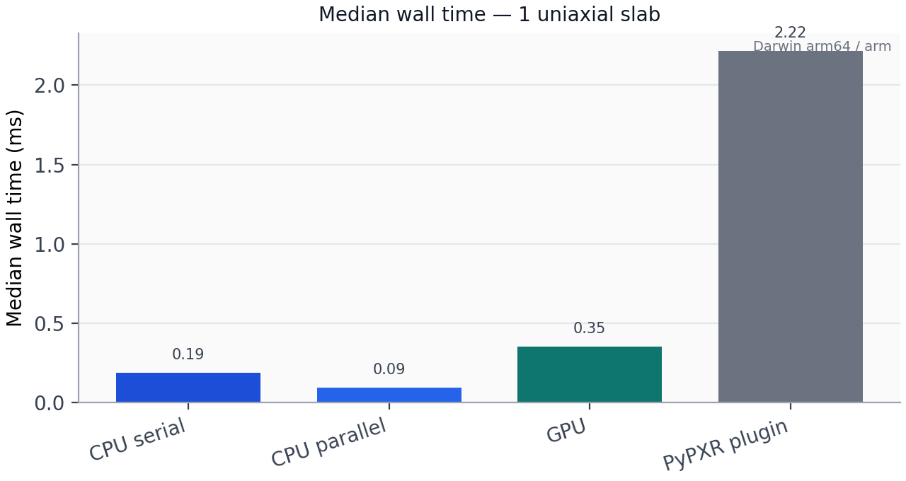
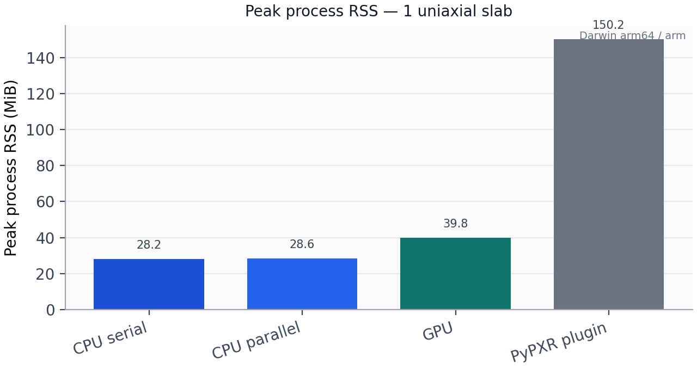
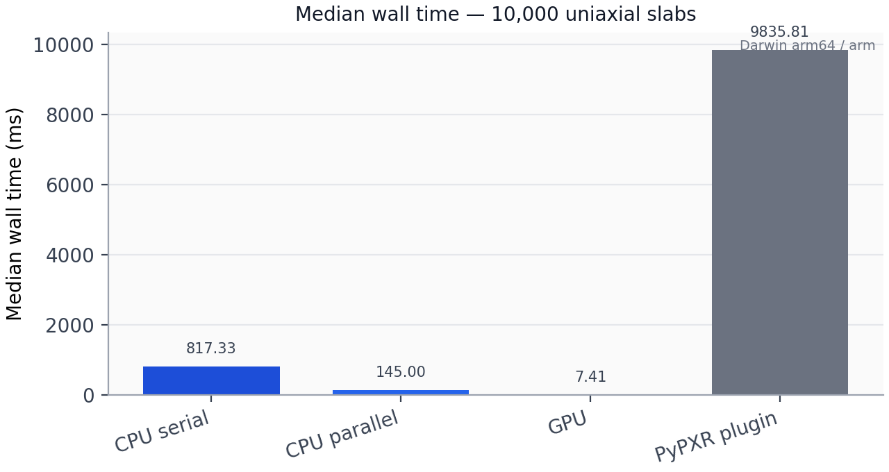
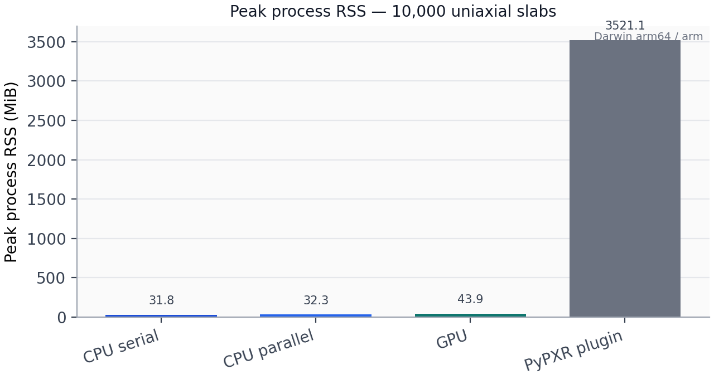
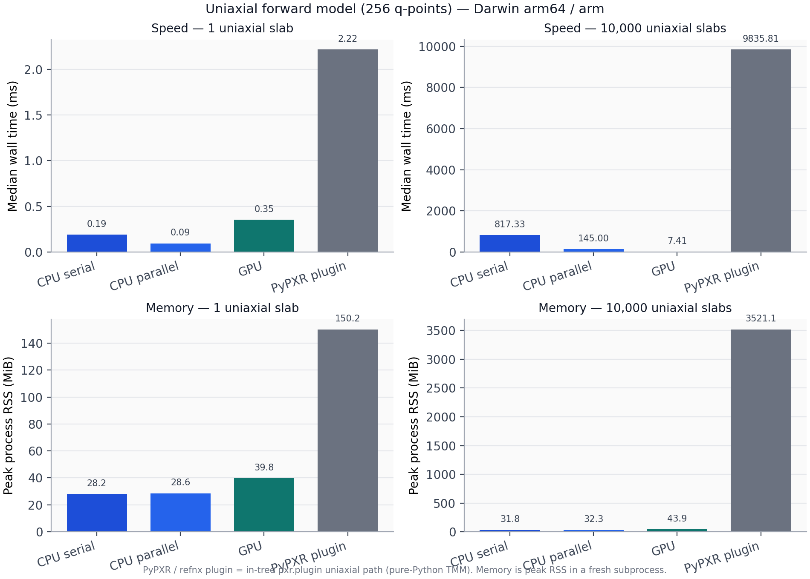

# refloxide

A blazingly fast 4x4 transfer matrix method for polarized reflectivity from stratified media.

refloxide is a ground-up rewrite aimed at energy-dispersive soft X-ray and
polarized neutron work where scalar codes fall short. It ships a Rust core
(optional wgpu GPU path), thin Python bindings, and opt-in modeling /
objective layers.

Related baselines:

- [refnx](https://github.com/refnx/refnx) — scalar Abeles / Parratt and the
  host for the historical **PyPXR** polarized plugin API (vendored in-tree as
  `refloxide.pxr.plugin`).
- [refl1d](https://github.com/reflectometry/refl1d) — strong for scalar
  stacks; awkward for general dielectric tensors.

## Performance

Same **uniaxial** stack, four backends:

| Label | What runs |
| --- | --- |
| CPU serial | `refloxide` Rust kernel, `parallel=False` |
| CPU parallel | `refloxide` Rust kernel, `parallel=True` |
| GPU | `refloxide` wgpu recursion (`device="gpu"`) |
| PyPXR plugin | in-tree `pxr.plugin` uniaxial path (pure-Python TMM; the refnx-plugin shape) |

Headline sizes: **1 uniaxial film slab** and **10,000 uniaxial film slabs**
(plus vacuum / substrate), 256 q-points. Metrics: median wall time and peak
process RSS (fresh subprocess per backend).

```bash
uv sync --group dev --group plugin
uv run python examples/gpu_backend_bench.py --plot
```

CI runs the same script on Ubuntu and macOS and uploads artifacts (GPU rows
only when a wgpu adapter is present).

### 1 uniaxial slab





### 10,000 uniaxial slabs





Combined grid (also written by the bench):



Notes:

- This is an **apples-to-apples uniaxial** comparison. Scalar Abeles is
  deliberately not plotted here — it solves a cheaper problem.
- Memory bars are peak process RSS in a fresh interpreter (includes NumPy
  inputs, Rust working set, and Python temporaries on the plugin path).
- `refnx` is a **dev/plugin** extra (needed to import the plugin path), not a
  core runtime dependency of the Rust kernels. See
  [GPU guide](docs/guides/gpu.md).

## Installation

```bash
pip install refloxide
```

Or with uv:

```bash
uv add refloxide
```

## Quick start

```python
from refloxide.tmm import uniaxial_reflectivity

# device="cpu" (default, f64) or device="gpu" (f32 recursion via wgpu)
refl, tran = uniaxial_reflectivity(q, layers, tensor, energy_ev, device="cpu")
```

## Development

### Prerequisites

- Python 3.13+
- [uv](https://docs.astral.sh/uv/) for package management

### Setup

```bash
git clone https://github.com/ALS-RSOXS/refloxide.git
cd refloxide
make develop   # uv sync --group dev --group plugin + maturin develop --release
```

### Tests and checks

```bash
make test
make verify
uv run pytest tests/test_gpu_precision.py -q
```

### Documentation

```bash
make docs-serve
```

## License

GPL-3.0 — see [LICENSE](LICENSE).
