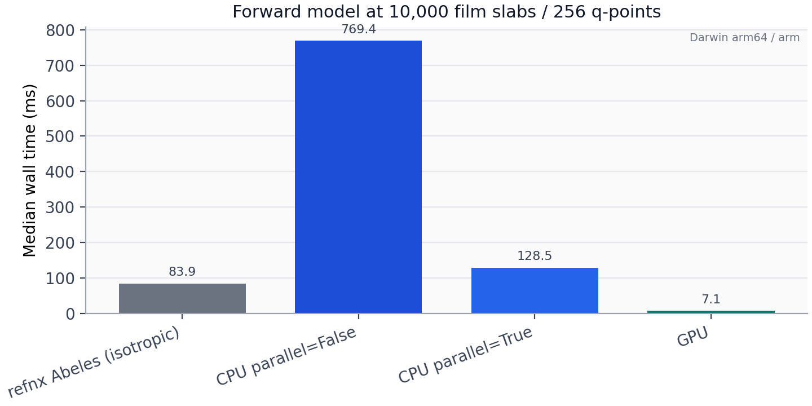
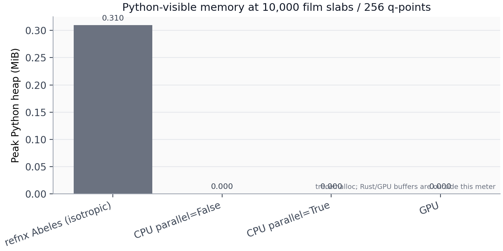
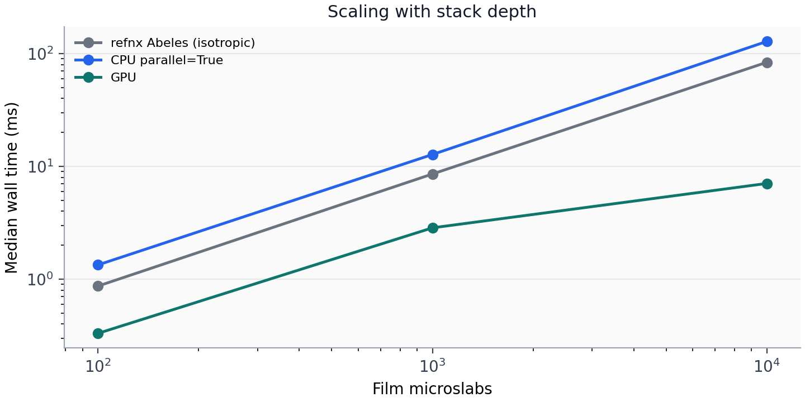

# refloxide

A blazingly fast 4x4 transfer matrix method for polarized reflectivity from stratified media.

refloxide is a ground-up rewrite aimed at energy-dispersive soft X-ray and
polarized neutron work where scalar codes fall short. It ships a Rust core
(optional wgpu GPU path), thin Python bindings, and opt-in modeling /
objective layers.

Related baselines (different physics scopes):

- [refnx](https://github.com/refnx/refnx) — excellent scalar Abeles / Parratt;
  not a tensor / polarized-anisotropy engine.
- [refl1d](https://github.com/reflectometry/refl1d) — strong for scalar
  stacks; awkward for general dielectric tensors.

## Performance

Headline forward-model cost at **10,000 film microslabs** and 256 q-points
(median wall time and memory). Regenerate with:

```bash
uv sync --group dev
uv run python examples/gpu_backend_bench.py --plot
```

CI also runs this benchmark on Ubuntu and macOS and uploads CSV / PNG
artifacts (GPU rows appear only when a wgpu adapter is available).







Notes on reading the plots:

- **refnx Abeles** is scalar isotropic **2x2** Abeles/Parratt. It does less
  work per layer than polarized uniaxial recursion, so it can beat
  **refloxide CPU** on wall time even at 10k slabs. That is algorithm cost,
  not a regression — compare it as a cheap isotropic floor.
- **refloxide CPU / GPU** solve the uniaxial-z recursion (polarized
  diagonals). On Apple Silicon here, GPU is ~13x faster than parallel CPU
  and ~9x faster than Abeles at 10k slabs.
- **Memory** bars are peak **Python** heap (`tracemalloc`). Rust and GPU
  device buffers sit outside that meter, which is why the native kernels
  look near-zero while Abeles still allocates NumPy-side temporaries.
- **GPU** needs a wgpu adapter (Metal / Vulkan / DX12). Transmission is not
  computed on GPU; see [GPU guide](docs/guides/gpu.md).
- `refnx` is only required for the optional Abeles row and for fitting
  helpers (`dev` / `plugin` extras) — not for installing or importing the
  core package.

## Installation

```bash
pip install refloxide
```

Or with uv:

```bash
uv add refloxide
```

## Quick start

```python
from refloxide.tmm import uniaxial_reflectivity

# device="cpu" (default, f64) or device="gpu" (f32 recursion via wgpu)
refl, tran = uniaxial_reflectivity(q, layers, tensor, energy_ev, device="cpu")
```

## Development

### Prerequisites

- Python 3.13+
- [uv](https://docs.astral.sh/uv/) for package management

### Setup

```bash
git clone https://github.com/ALS-RSOXS/refloxide.git
cd refloxide
make install
```

### Tests and checks

```bash
make test
make verify
```

GPU precision tests skip when no adapter is present:

```bash
uv run pytest tests/test_gpu_precision.py -q
```

### Documentation

```bash
make docs-serve
```

## License

GPL-3.0 — see [LICENSE](LICENSE).
