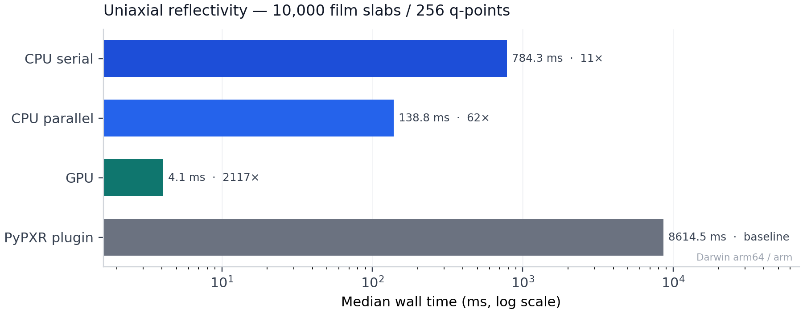

# refloxide

An extremely fast 4x4 transfer-matrix engine for **polarized** reflectivity
from stratified media — written in Rust, with optional wgpu GPU acceleration
and thin Python bindings.

- Blazing forward models for uniaxial stacks (CPU + GPU)
- Drop-in polarized path relative to the historical PyPXR / refnx plugin API
- Opt-in modeling and objective layers for multi-energy fitting

## Performance

On **10,000 uniaxial film slabs** (256 q-points), GPU finishes in ~4&nbsp;ms —
about **2,000×** faster than the in-tree PyPXR / refnx plugin path, with ~50×
less peak RSS.

<p align="center">
  
</p>

<p align="center">
  <sub>
    Apple Silicon (Darwin arm64) · same uniaxial stack · median of 3 runs ·
    regenerate with <code>uv run python examples/gpu_backend_bench.py --plot</code>
  </sub>
</p>

<details>
<summary><strong>Full benchmark details</strong> — 1 slab &amp; 10k slabs, speed + memory, methodology</summary>

<br>

Same uniaxial problem on four backends:

| Backend | Implementation |
| --- | --- |
| CPU serial | Rust kernel, `parallel=False` |
| CPU parallel | Rust kernel, `parallel=True` |
| GPU | wgpu recursion (`device="gpu"`) |
| PyPXR plugin | in-tree `refloxide.pxr.plugin` uniaxial path (pure-Python TMM) |

**1 uniaxial slab**

<p align="center">
  
  
</p>

**10,000 uniaxial slabs**

<p align="center">
  
  
</p>

**Combined grid**

<p align="center">
  
</p>

Notes:

- Apples-to-apples **uniaxial** comparison (not scalar Abeles).
- Memory is peak process RSS in a fresh subprocess.
- `refnx` is a **dev/plugin** extra for the plugin import graph only — not a
  core runtime dependency of the Rust kernels.
- CI runs the same script on Ubuntu and macOS and uploads artifacts; GPU rows
  appear only when a wgpu adapter is present.
- Guide: [`docs/guides/gpu.md`](docs/guides/gpu.md)

```bash
uv sync --group dev --group plugin
uv run python examples/gpu_backend_bench.py --plot
```

</details>

## Installation

```bash
pip install refloxide
# or
uv add refloxide
```

## Quick start

```python
from refloxide.tmm import uniaxial_reflectivity

# device="cpu" (default, f64) or device="gpu" (f32 recursion via wgpu)
refl, tran = uniaxial_reflectivity(q, layers, tensor, energy_ev, device="cpu")
```

## Development

```bash
git clone https://github.com/ALS-RSOXS/refloxide.git
cd refloxide
make develop   # uv sync --group dev --group plugin + maturin develop --release
make test
make verify
```

GPU precision tests skip when no adapter is present:

```bash
uv run pytest tests/test_gpu_precision.py -q
```

Docs: `make docs-serve`

## License

GPL-3.0 — see [LICENSE](LICENSE).
