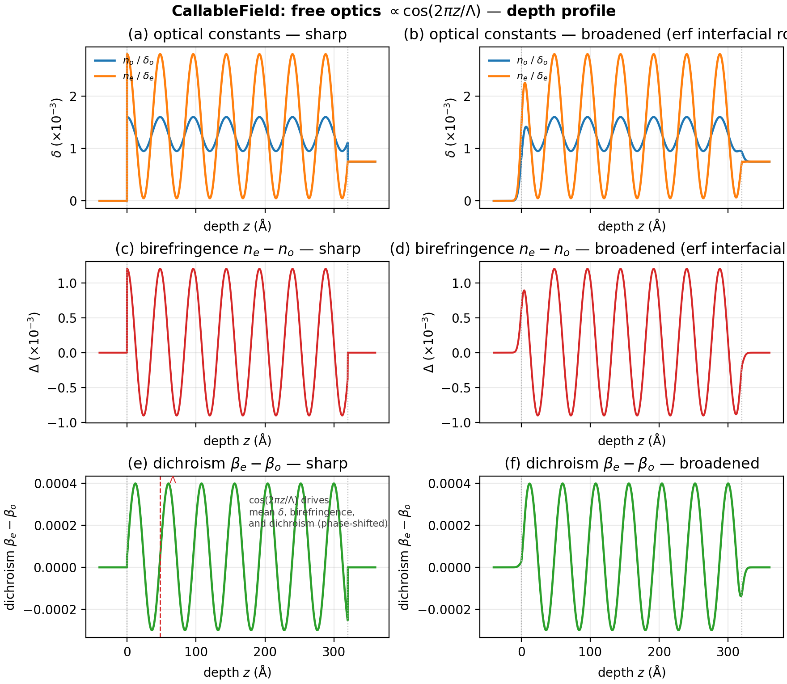
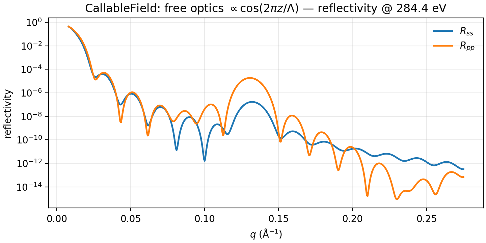
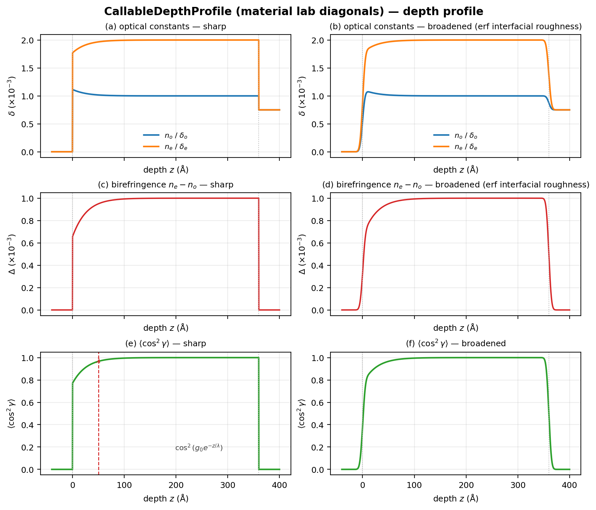
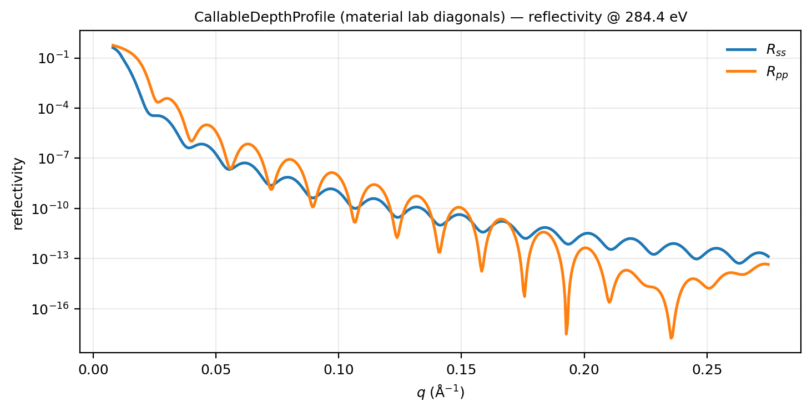
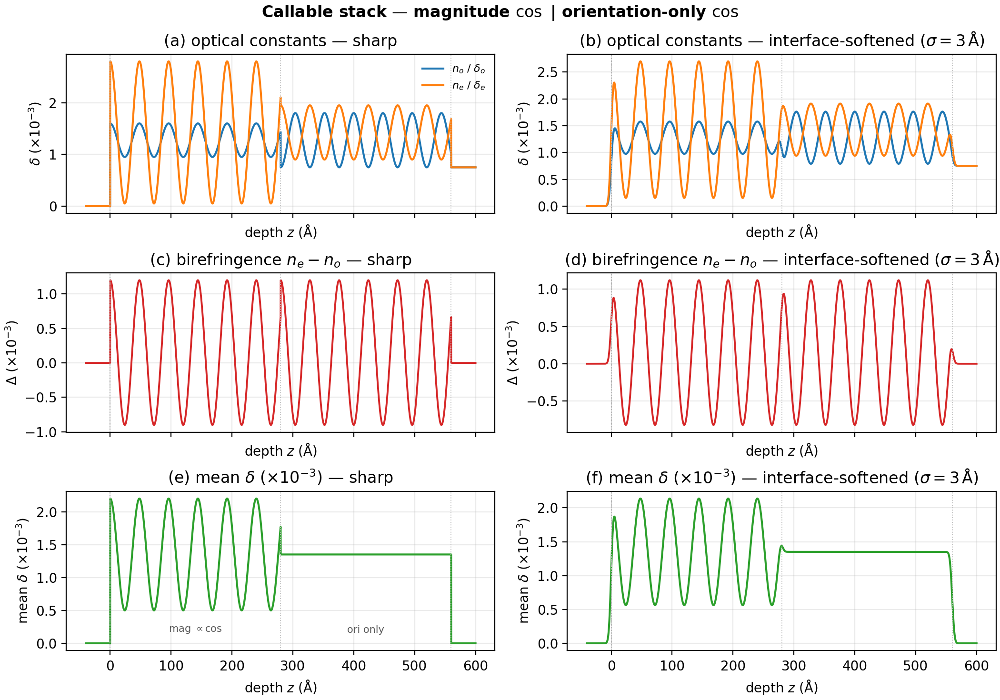
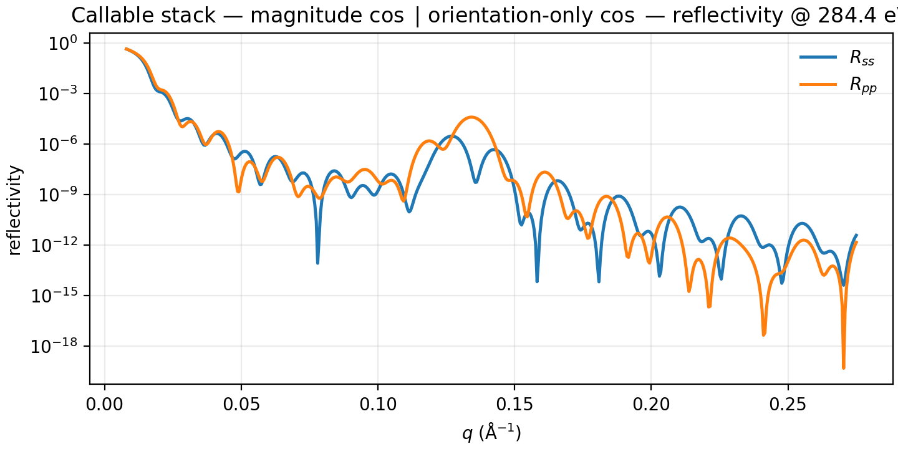

# Callable profiles

Typed Python escape hatches under [Functional forms](functional_forms.md):
you supply the depth law (or full tensor map). `CallableField` attaches to
any `DepthProfile` channel (`phi`, `gamma`, `delta_o`, …). For named
`Spline` / `Polynomial` fields see [Splines](splines.md) and
[Polynomials](polynomials.md); for `SecondOrderTransition` see
[Phase transitions](phase_transitions.md).

Shared preamble:

--8<-- "guides/building_structures/_preamble.md"

## CallableField — oscillatory free optics

**Builder:** `case_callable_field`

A $\cos(2\pi z/\Lambda)$ carrier modulates the mean $\delta$ amplitude;
birefringence follows the same cosine, while dichroism ($\beta_e-\beta_o$)
uses a phase-shifted sine so absorption anisotropy is not locked to the
dispersion oscillation. Attach four `CallableField`s (or share one helper)
to `delta_o` / `delta_e` / `beta_o` / `beta_e`.

```python
import numpy as np
from numpy.typing import NDArray
from refnx.analysis import Parameter

period = Parameter(48.0, name="period", vary=True, bounds=(20.0, 120.0))


def free_delta_o(
    z: NDArray[np.float64], *, period: float, thickness: float
) -> NDArray[np.float64]:
    c = np.cos(2 * np.pi * z / period)
    mid = 1.35e-3 + 0.85e-3 * c
    biref = 0.15e-3 + 1.05e-3 * c
    return mid - 0.5 * biref


def free_delta_e(
    z: NDArray[np.float64], *, period: float, thickness: float
) -> NDArray[np.float64]:
    c = np.cos(2 * np.pi * z / period)
    mid = 1.35e-3 + 0.85e-3 * c
    biref = 0.15e-3 + 1.05e-3 * c
    return mid + 0.5 * biref


def free_beta_o(
    z: NDArray[np.float64], *, period: float, thickness: float
) -> NDArray[np.float64]:
    s = np.sin(2 * np.pi * z / period)
    b_mid = 4.5e-4 + 2.5e-4 * s
    dich = 0.5e-4 + 3.5e-4 * s
    return np.clip(b_mid - 0.5 * dich, 5e-5, None)


def free_beta_e(
    z: NDArray[np.float64], *, period: float, thickness: float
) -> NDArray[np.float64]:
    s = np.sin(2 * np.pi * z / period)
    b_mid = 4.5e-4 + 2.5e-4 * s
    dich = 0.5e-4 + 3.5e-4 * s
    return np.clip(b_mid + 0.5 * dich, 5e-5, None)


params = {"period": period}
layer = DepthProfile(
    material=mat,
    thickness=320.0,
    delta_o=CallableField(free_delta_o, params=params),
    delta_e=CallableField(free_delta_e, params=params),
    beta_o=CallableField(free_beta_o, params=params),
    beta_e=CallableField(free_beta_e, params=params),
)
stack = vac | layer | si
```





## CallableDepthProfile

**Builder:** `case_callable_tensor`

Full lab-tensor map; can read material diagonals.

```python
from refloxide.profiles import lab_tensor_from_order_parameter
from refnx.analysis import Parameter

g0 = Parameter(0.5, name="g0", vary=True, bounds=(0.0, 1.2))
lam = Parameter(50.0, name="lam", vary=True, bounds=(10.0, 150.0))

def my_tensor(
    z: NDArray[np.float64],
    *,
    material: FreeUniTensor,
    energy_ev: float,
    g0: float,
    lam: float,
    thickness: float,
) -> NDArray[np.complex128]:
    n_o, n_e = material.lab_diagonal_at(energy_ev)
    cos2 = np.cos(g0 * np.exp(-z / lam)) ** 2
    return lab_tensor_from_order_parameter(n_o, n_e, cos2, kind="cos2_gamma")

layer = CallableDepthProfile(
    my_tensor,
    material=mat,
    params={"g0": g0, "lam": lam},
    thickness=360.0,
    roughness=2.0,
    n_slabs=96,
)
stack = vac | layer | si
```





## Stacking

**Builder:** `case_callable_field_short_stack`

Two $\cos$ layers: **top** modulates mean $\delta$ and birefringence (the
refractive-index traces oscillate); **bottom** holds mean $\delta$ fixed and
oscillates only orientation (birefringence / dichroism). Aux panel plots
mean $\delta$. The Poly | Spline | cos zoo is on
[Stacking examples](stacking.md).

```python
# magnitude-oscillating callables: free_delta_* / free_beta_* as above
params = {"period": period}
mag = DepthProfile(
    material=mat,
    thickness=280.0,
    delta_o=CallableField(free_delta_o, params=params),
    delta_e=CallableField(free_delta_e, params=params),
    beta_o=CallableField(free_beta_o, params=params),
    beta_e=CallableField(free_beta_e, params=params),
)


def ori_delta_o(
    z: NDArray[np.float64], *, period: float, thickness: float
) -> NDArray[np.float64]:
    c = np.cos(2 * np.pi * z / period)
    mid = 1.35e-3
    biref = 0.15e-3 + 1.05e-3 * c
    return mid - 0.5 * biref


def ori_delta_e(
    z: NDArray[np.float64], *, period: float, thickness: float
) -> NDArray[np.float64]:
    c = np.cos(2 * np.pi * z / period)
    mid = 1.35e-3
    biref = 0.15e-3 + 1.05e-3 * c
    return mid + 0.5 * biref


def ori_beta_o(
    z: NDArray[np.float64], *, period: float, thickness: float
) -> NDArray[np.float64]:
    s = np.sin(2 * np.pi * z / period)
    dich = 0.5e-4 + 3.5e-4 * s
    return np.clip(4.5e-4 - 0.5 * dich, 5e-5, None)


def ori_beta_e(
    z: NDArray[np.float64], *, period: float, thickness: float
) -> NDArray[np.float64]:
    s = np.sin(2 * np.pi * z / period)
    dich = 0.5e-4 + 3.5e-4 * s
    return np.clip(4.5e-4 + 0.5 * dich, 5e-5, None)


ori = DepthProfile(
    material=mat,
    thickness=280.0,
    delta_o=CallableField(ori_delta_o, params=params),
    delta_e=CallableField(ori_delta_e, params=params),
    beta_o=CallableField(ori_beta_o, params=params),
    beta_e=CallableField(ori_beta_e, params=params),
)
stack = vac | mag | ori | si
model = ReflectModel(stack, energies=[284.4], parallel=False)
```




