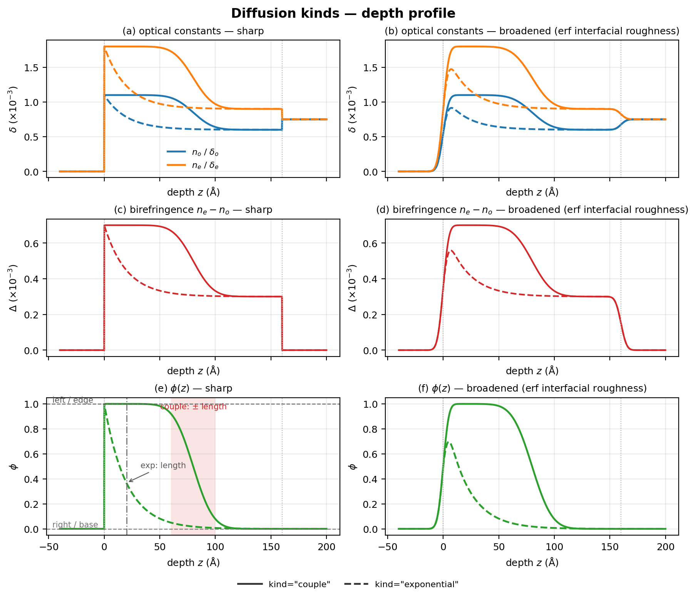
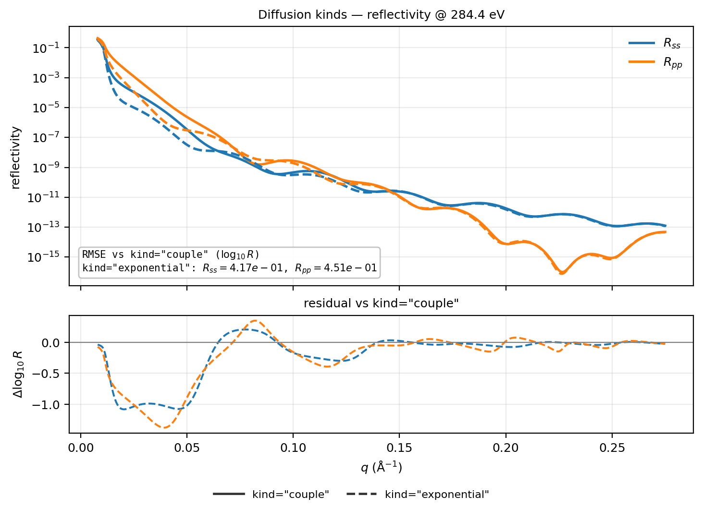
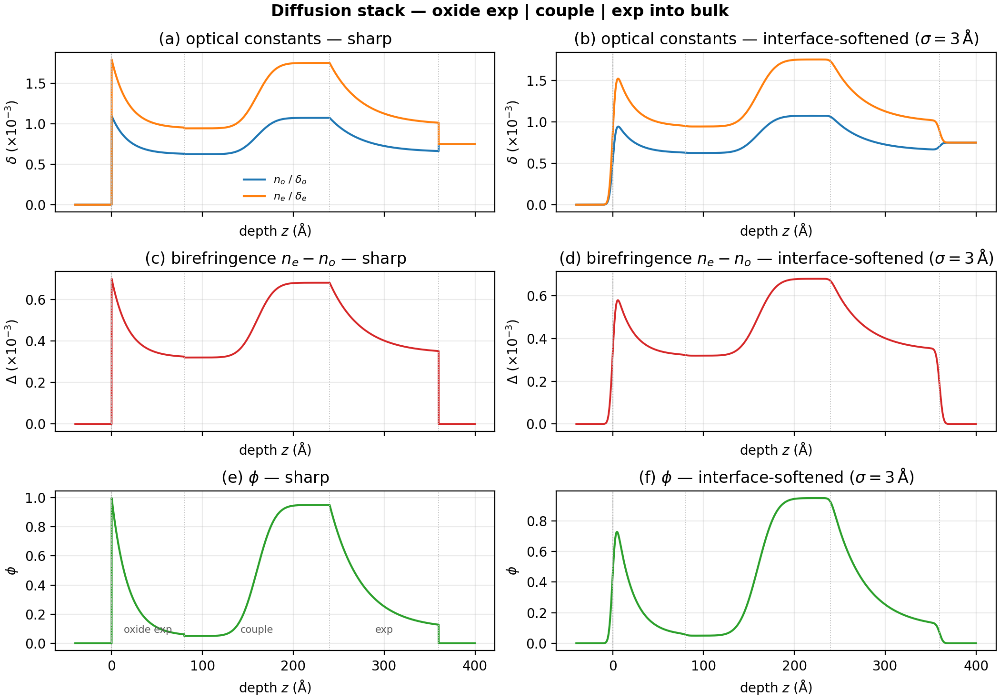
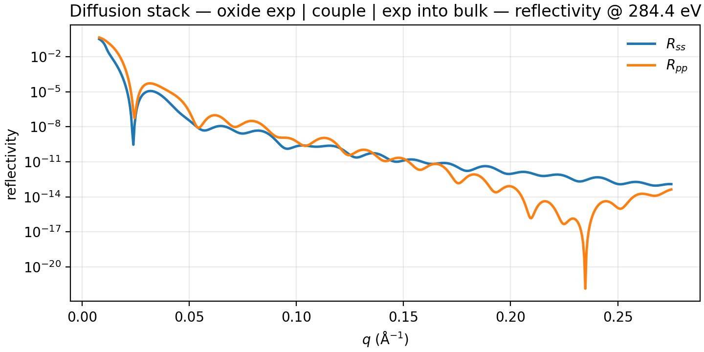

# Diffusion

Fick couple and single-sided exponential depth laws. The figures use Mix
volume fraction (`phi`); the same `Diffusion` field can instead drive free
optical channels (`delta_o`, …) on a single material. Does not cover spline /
polynomial grades ([Functional forms](functional_forms.md)) or second-order
transitions ([Phase transitions](phase_transitions.md)).

**Builder:** `case_diffusion`

Shared preamble:

--8<-- "guides/building_structures/_preamble.md"

## Couple vs exponential

Annotated: `left`/`edge`, `right`/`base`, couple $\pm$`length`, exp `length`.
Depth figure overlays **`kind="couple"`** vs **`kind="exponential"`** with
shared $n_o$/$n_e$ colors and linestyle per kind (sharp | broadened columns;
rows: optical constants, birefringence, $\phi$). Reflectivity uses the same
linestyles for $R_{ss}$/$R_{pp}$ plus $\Delta\log_{10} R$ vs couple.

```python
phi = Diffusion(thickness=160.0, left=1.0, right=0.0, length=20.0, kind="couple")
# or: Diffusion(..., kind="exponential", edge=1.0, base=0.0, length=20.0)
layer = DepthProfile(
    material=Mix([mat_a, mat_b], rule="linear"),
    thickness=160.0,
    roughness=1.0,
    phi=phi,
)
stack = vac | layer | si
```

`couple` is the erf Fick couple; `exponential` is single-sided
`base+(edge-base)exp(-z/length)` (`finite` reserved):





## Stacking

**Builder:** `case_diffusion_short_stack`

Three Mix grades under `|`: surface **oxidation** (`exponential` from the
vacuum edge), an interdiffusion **couple** between materials, then another
**exponential** from that new surface into the bulk. $\phi$ is continuous at
the internal interfaces.

```python
oxide = DepthProfile(
    material=Mix([mat_a, mat_b], rule="linear"),
    thickness=80.0,
    phi=Diffusion(
        thickness=80.0, kind="exponential", edge=1.0, base=0.05, length=18.0
    ),
)
couple = DepthProfile(
    material=Mix([mat_a, mat_b], rule="linear"),
    thickness=160.0,
    phi=Diffusion(
        thickness=160.0, kind="couple", left=0.05, right=0.95, length=22.0
    ),
)
into_bulk = DepthProfile(
    material=Mix([mat_a, mat_b], rule="linear"),
    thickness=120.0,
    phi=Diffusion(
        thickness=120.0, kind="exponential", edge=0.95, base=0.10, length=35.0
    ),
)
stack = vac | oxide | couple | into_bulk | si
model = ReflectModel(stack, energies=[284.4], parallel=False)
```




