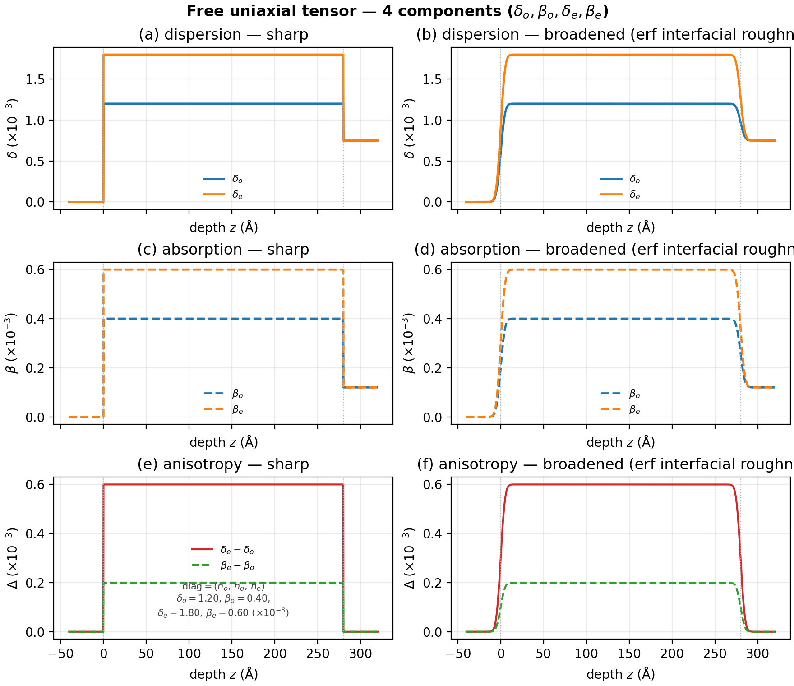
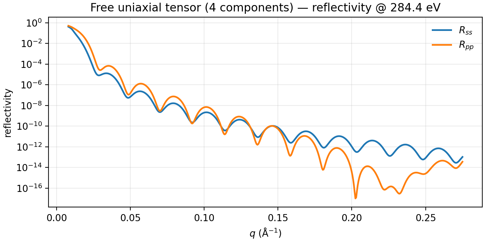
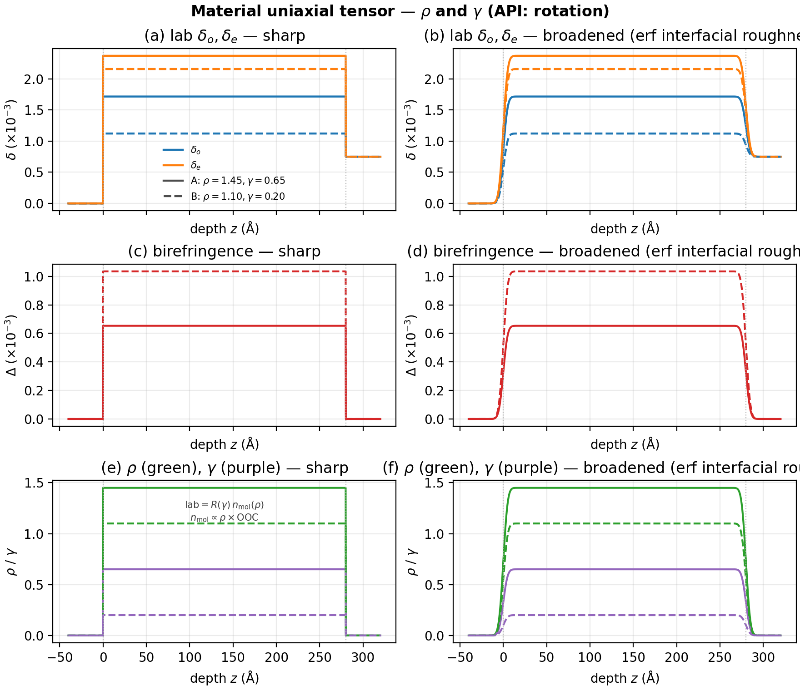
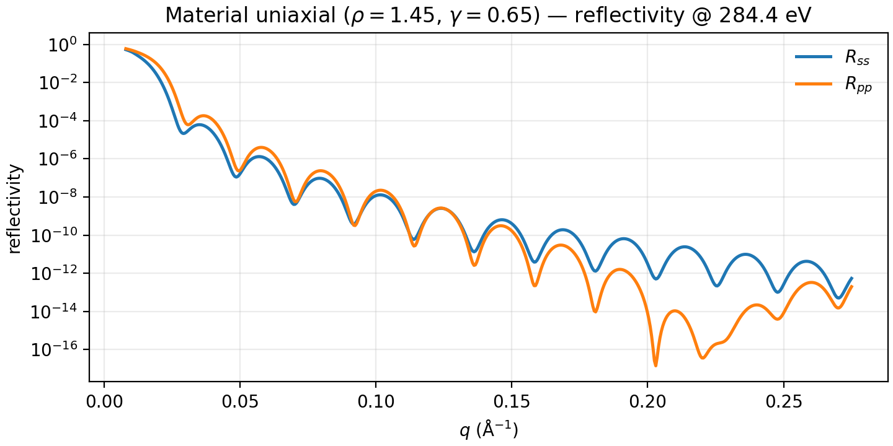
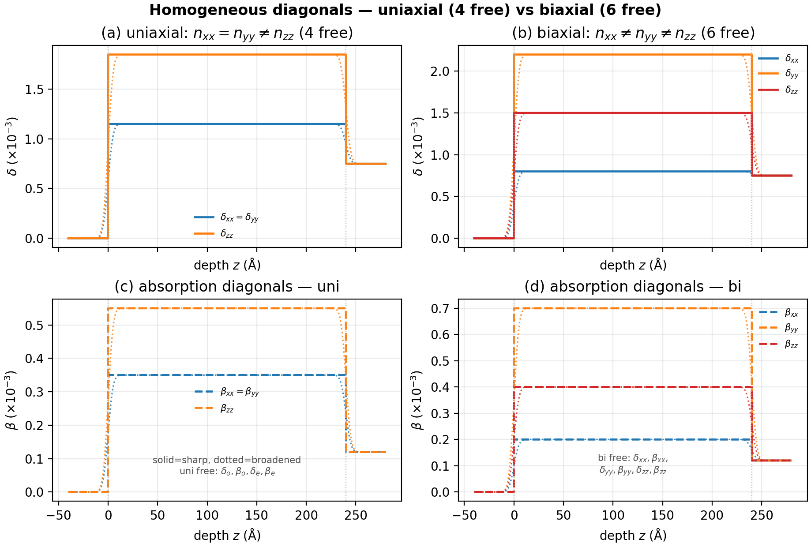
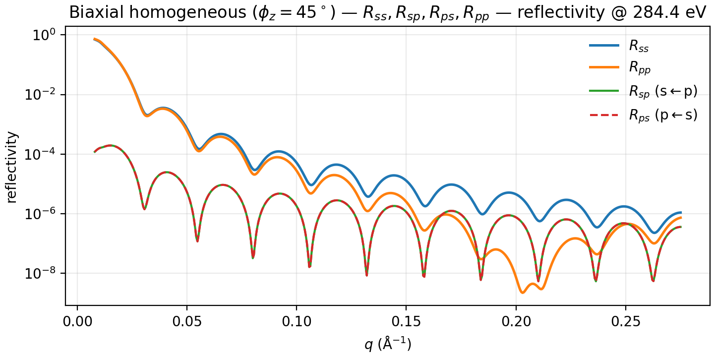

# Homogeneous slabs

Constant films: one scatterer, one thickness, one roughness. No depth-dependent
Mix or named profile fields. Two material styles — **free tensor** components
vs **material** (OOC + $\rho$ + $\gamma$) — and the uniaxial vs biaxial
diagonal packing.

Shared preamble:

--8<-- "guides/building_structures/_preamble.md"

## Free uniaxial tensor (4 components)

**Builder:** `case_homogeneous_slab`

`FreeUniTensor` / `FreeTensorSLD` exposes four independent parameters per
energy: $\delta_o$, $\beta_o$, $\delta_e$, $\beta_e$. The lab diagonal is
$(n_o,\,n_o,\,n_e)$ with $n=\delta+i\beta$.

```python
mat = FreeUniTensor(energies=[284.4], name="film")
ch = mat.channel_at(284.4)
ch.delta_o.setp(1.2e-3)
ch.beta_o.setp(4e-4)
ch.delta_e.setp(1.8e-3)
ch.beta_e.setp(6e-4)
stack = vac | mat(280.0, 2.0) | si
model = ReflectModel(stack, energies=[284.4], parallel=False)
```





## Material uniaxial tensor ($\rho$, $\gamma$)

**Builder:** `case_homogeneous_material_tensor`

`UniTensorSLD` loads molecular indices from an optical-constants table,
scales them by mass density $\rho$, and rotates into the lab frame with
polar angle $\gamma$ (API name: `rotation`). Depth figure contrasts two
$(\rho,\gamma)$ pairs on the same OOC.

```python
from refloxide.data import OpticalConstants
from refloxide.model import UniTensorSLD
import polars as pl
import numpy as np

ooc = OpticalConstants.from_source(
    pl.DataFrame(
        {
            "energy": np.linspace(250.0, 320.0, 20),
            "n_xx": np.full(20, 1.0e-3),
            "n_ixx": np.full(20, 3.0e-4),
            "n_zz": np.full(20, 2.0e-3),
            "n_izz": np.full(20, 6.0e-4),
        }
    )
)
film = UniTensorSLD(ooc, density=1.45, rotation=0.65, name="film")
stack = vac | film(280.0, 2.0) | si
model = ReflectModel(stack, energies=[284.4], parallel=False)
```





## Uniaxial vs biaxial diagonals

**Builder:** `case_homogeneous_uni_vs_bi`

Uniaxial packing constrains $n_{xx}=n_{yy}$ (four free real scalars:
$\delta_o,\beta_o,\delta_e,\beta_e$). Biaxial frees $n_{yy}$ as well (six
free scalars: $\delta_{xx},\beta_{xx},\delta_{yy},\beta_{yy},\delta_{zz},\beta_{zz}$).
Depth figure shows the **principal** diagonal $\delta$ and $\beta$ channels.
Reflectivity uses `general_reflectivity` on the same film after a $45^\circ$
in-plane rotation (lab-frame diagonal biaxial keeps $R_{sp}=R_{ps}=0$ under
$xz$ incidence) and plots $R_{ss}$, $R_{sp}$, $R_{ps}$, $R_{pp}$.
Kernel packing is $[[R_{pp}, R_{sp}], [R_{ps}, R_{ss}]]$ with
$R_{sp}$ = s reflected from p incident (`refl[:, 0, 1]`) and
$R_{ps}$ = p reflected from s incident (`refl[:, 1, 0]`).

```python
import numpy as np
from refloxide.tmm import general_reflectivity

n_xx = 0.80e-3 + 2.0e-4j
n_yy = 2.20e-3 + 7.0e-4j
n_zz = 1.50e-3 + 4.0e-4j
t = 240.0

def diag(nx, ny, nz):
    m = np.zeros((3, 3), dtype=np.complex128)
    m[0, 0], m[1, 1], m[2, 2] = nx, ny, nz
    return m

phi = np.deg2rad(45.0)
c, s = np.cos(phi), np.sin(phi)
rot_z = np.array([[c, -s, 0.0], [s, c, 0.0], [0.0, 0.0, 1.0]])
t_lab = rot_z @ diag(n_xx, n_yy, n_zz) @ rot_z.T
layers = np.array(
    [
        [0.0, 0.0, 0.0, 0.0],
        [t, 0.5 * (t_lab[0, 0].real + t_lab[1, 1].real),
         0.5 * (t_lab[0, 0].imag + t_lab[1, 1].imag), 2.0],
        [0.0, 7.5e-4, 1.2e-4, 3.0],
    ],
    dtype=np.float64,
)
tensor = np.stack(
    [
        diag(0j, 0j, 0j),
        t_lab,
        diag(7.5e-4 + 1.2e-4j, 7.5e-4 + 1.2e-4j, 7.5e-4 + 1.2e-4j),
    ]
)
q = np.linspace(0.008, 0.275, 520)
refl = general_reflectivity(q, layers, tensor, 284.4, parallel=False)
# [[R_pp, R_sp], [R_ps, R_ss]]: R_sp = s<-p, R_ps = p<-s
r_pp, r_sp = refl[:, 0, 0], refl[:, 0, 1]
r_ps, r_ss = refl[:, 1, 0], refl[:, 1, 1]
```




