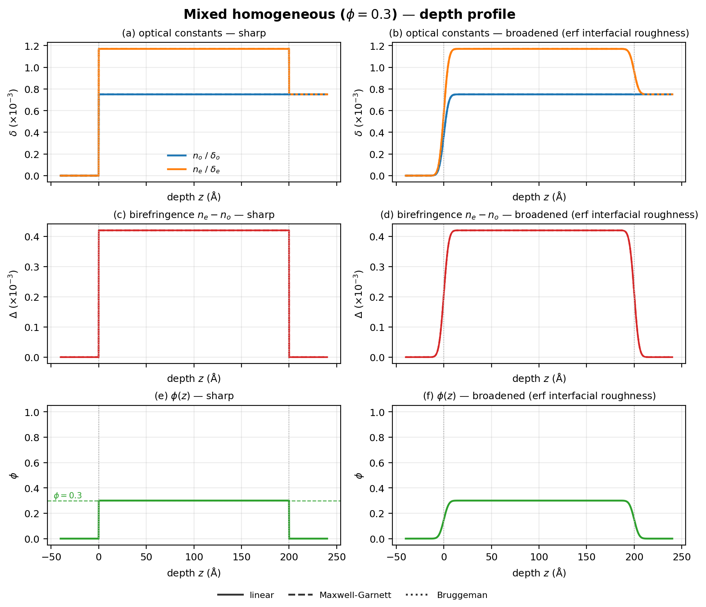
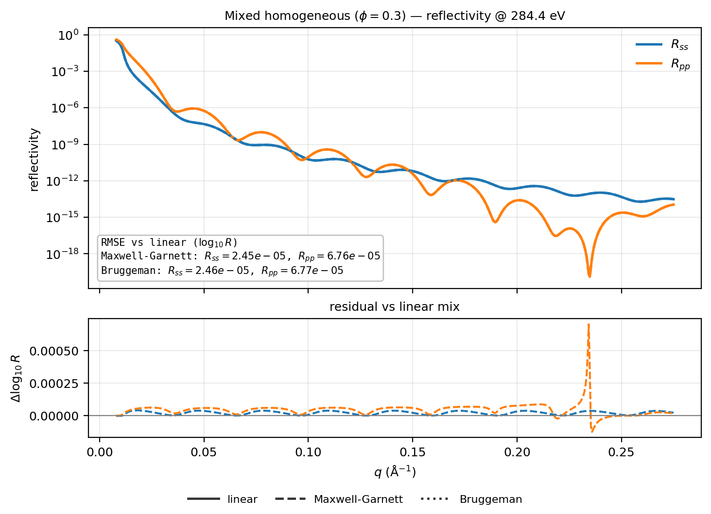
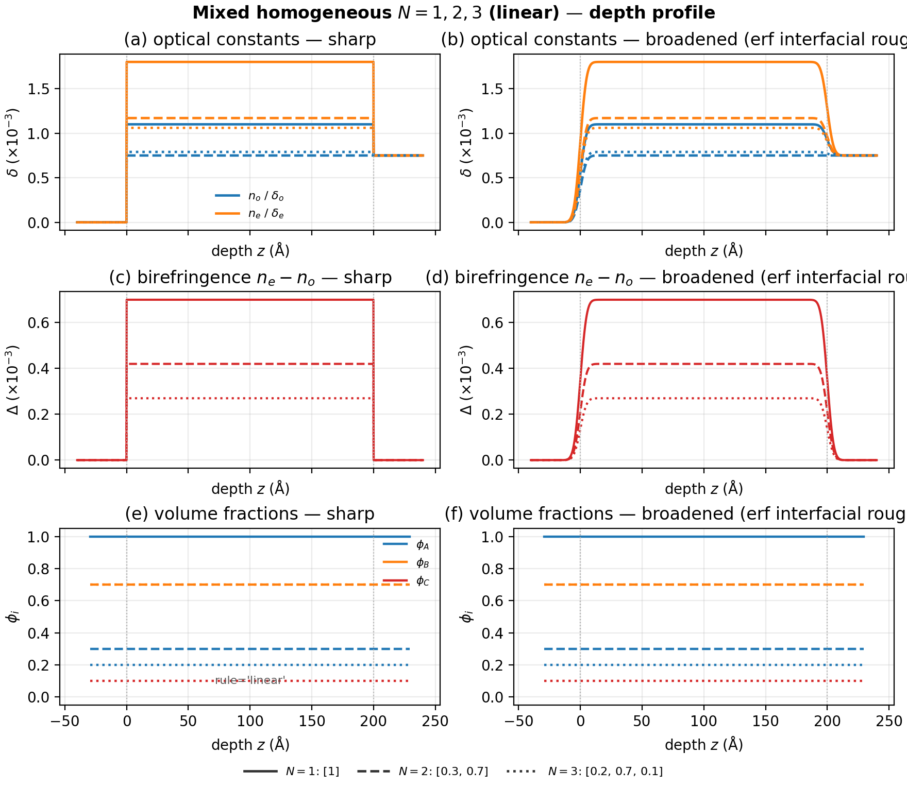
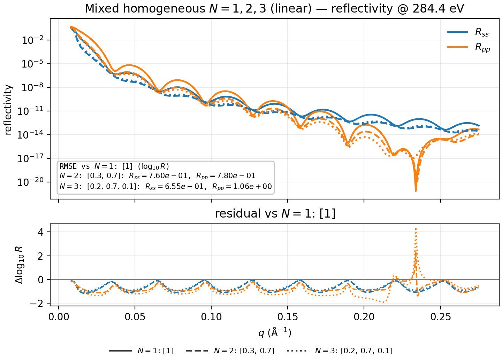

# Mixed slabs

Homogeneous `Mix` of laboratory uniaxial materials at fixed volume fractions.
Covers binary MixRule contrast and linear $N$-ary mixes.

Shared preamble:

--8<-- "guides/building_structures/_preamble.md"

## Binary MixRule comparison

**Builder:** `case_mixed_homogeneous`

Every `MixRule` is a separate `Mix` instance at the same $\phi$ (material A
fraction $0.3$). Maxwell-Garnett takes `host_index` as the continuous phase
(here material B):

```python
phi_a, phi_b = 0.3, 0.7
materials = [mat_a, mat_b]
fractions = [phi_a, phi_b]

mixed_linear = Mix(materials, fractions=fractions, rule="linear")
mixed_mg = Mix(
    materials, fractions=fractions, rule="maxwell_garnett", host_index=1
)
mixed_bruggeman = Mix(materials, fractions=fractions, rule="bruggeman")

stacks = {
    "linear": vac | mixed_linear(200.0, 2.0) | si,
    "maxwell_garnett": vac | mixed_mg(200.0, 2.0) | si,
    "bruggeman": vac | mixed_bruggeman(200.0, 2.0) | si,
}
```

Fixed $\phi=0.3$. Depth figure matches the CallableField template: left
column sharp, right column erf-broadened; rows are optical constants
($\delta$), birefringence, and $\phi(z)$. Channel keys use the common
$n_o/\delta_o$, $n_e/\delta_e$ notation. Mix methods are linestyle only,
with a bottom-centered legend (one column per method). Reflectivity keeps
$R_{ss}$/$R_{pp}$ color keys plus the same method legend; a residual panel
and RMSE box show $\Delta\log_{10} R$ vs the linear mix (soft-XR EMA curves
nearly overlap on absolute $R$).

### Mixing math

Channels are packed as $\rho=\delta+i\beta$ with
$n=1-\delta+i\beta$ and $\varepsilon=n^2$. Linear averages $\rho$; Maxwell–Garnett
and Bruggeman mix on $\varepsilon$, then map back to $\rho$.

**Linear** (volume-weighted channels; $\phi$ = fraction of A):

$$
\rho_\mathrm{lin}=\phi\,\rho_A+(1-\phi)\,\rho_B
$$

**Maxwell–Garnett** (host $H$, inclusion $I$, inclusion fraction $\phi_I$;
spherical EMA on $\varepsilon$):

$$
\alpha=\frac{\varepsilon_I-\varepsilon_H}{\varepsilon_I+2\varepsilon_H},\qquad
\varepsilon_\mathrm{MG}=\varepsilon_H\frac{1+2\phi_I\alpha}{1-\phi_I\alpha}
$$

**Bruggeman** (symmetric two-phase EMA on $\varepsilon$; $\phi$ = fraction of A):

$$
\phi\frac{\varepsilon_A-\varepsilon}{\varepsilon_A+2\varepsilon}
+(1-\phi)\frac{\varepsilon_B-\varepsilon}{\varepsilon_B+2\varepsilon}=0
$$

Closed form with
$\gamma=(3\phi-1)\varepsilon_A+(2-3\phi)\varepsilon_B$:

$$
\varepsilon_\mathrm{Br}=\frac{1}{4}\Bigl(\gamma+\sqrt{\gamma^2+8\varepsilon_A\varepsilon_B}\Bigr)
$$

After MG/Bruggeman, $\rho$ is recovered from $n=\sqrt{\varepsilon}$
($\operatorname{Re}n\ge 0$) via $\delta=1-\operatorname{Re}n$,
$\beta=\operatorname{Im}n$.





## $N=1,2,3$ materials (linear)

**Builder:** `case_mixed_homogeneous_nary`

Same sharp | broadened depth template, but linestyle now marks the number of
materials in a **linear** `Mix` (Maxwell–Garnett / Bruggeman remain binary-only).
Fraction vectors are listed explicitly; reflectivity residuals are relative to
the pure-$A$ ($N=1$) slab.

```python
mix_1 = Mix([mat_a], fractions=[1.0], rule="linear")
mix_2 = Mix([mat_a, mat_b], fractions=[0.3, 0.7], rule="linear")
mix_3 = Mix(
    [mat_a, mat_b, mat_c],
    fractions=[0.2, 0.7, 0.1],
    rule="linear",
)

stacks = {
    "N=1": vac | mix_1(200.0, 2.0) | si,
    "N=2": vac | mix_2(200.0, 2.0) | si,
    "N=3": vac | mix_3(200.0, 2.0) | si,
}
```

Bottom row of the depth figure draws horizontal lines at each listed
$\phi_A$, $\phi_B$, $\phi_C$ (color by material; linestyle by $N$).





## Stacking

A mixed film sits in a stack like any homogeneous slab:

```python
mixed = Mix([mat_a, mat_b], fractions=[0.3, 0.7], rule="linear")
stack = vac | mixed(120.0, 2.0) | mat(80.0, 1.0) | si
model = ReflectModel(stack, energies=[284.4], parallel=False)
```
