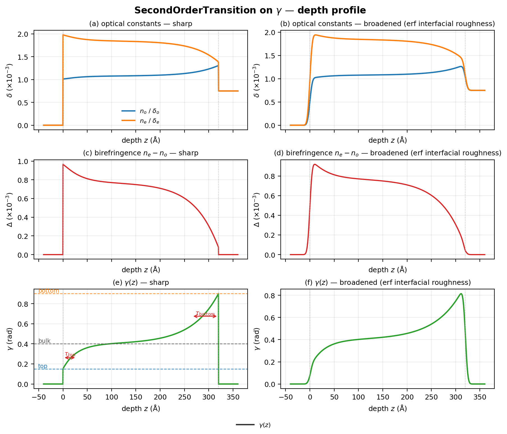
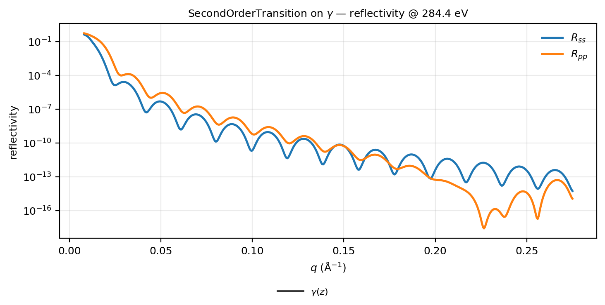
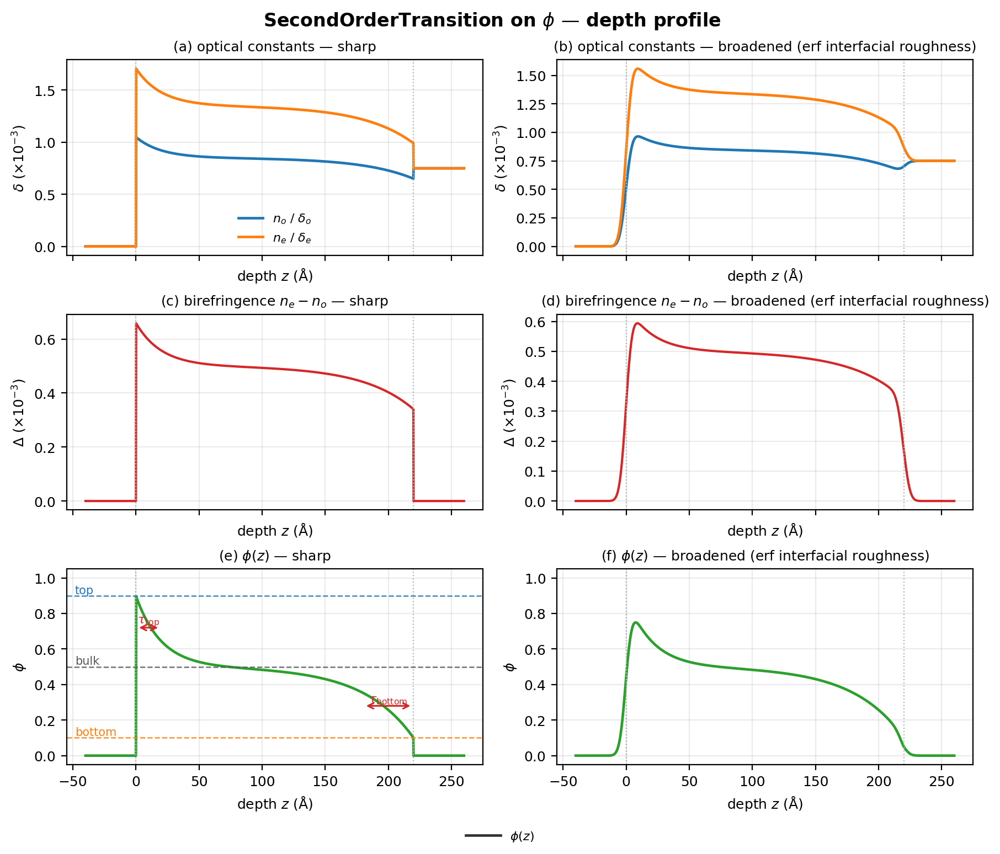
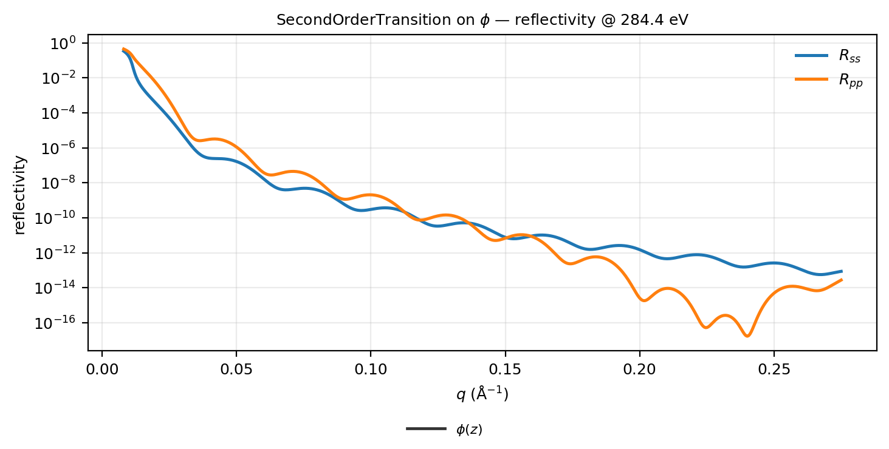
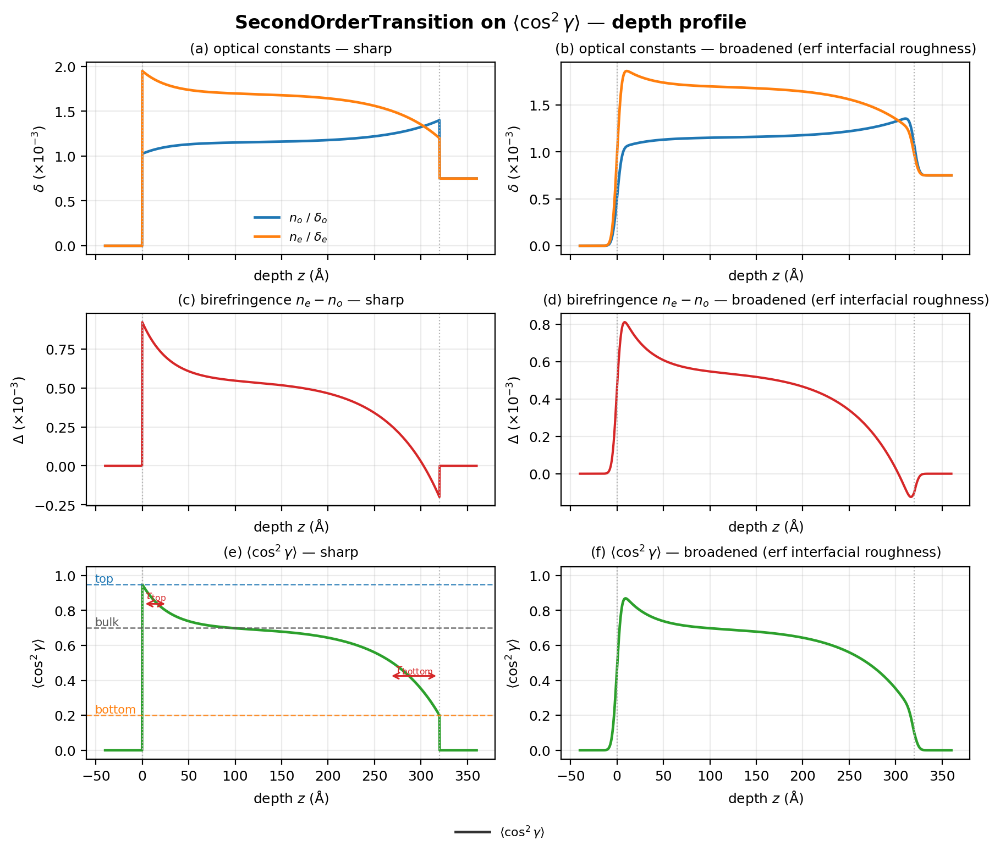
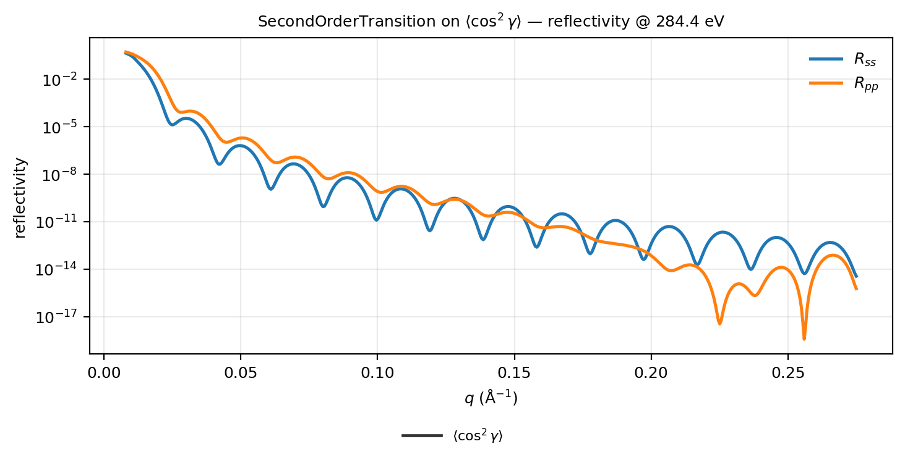
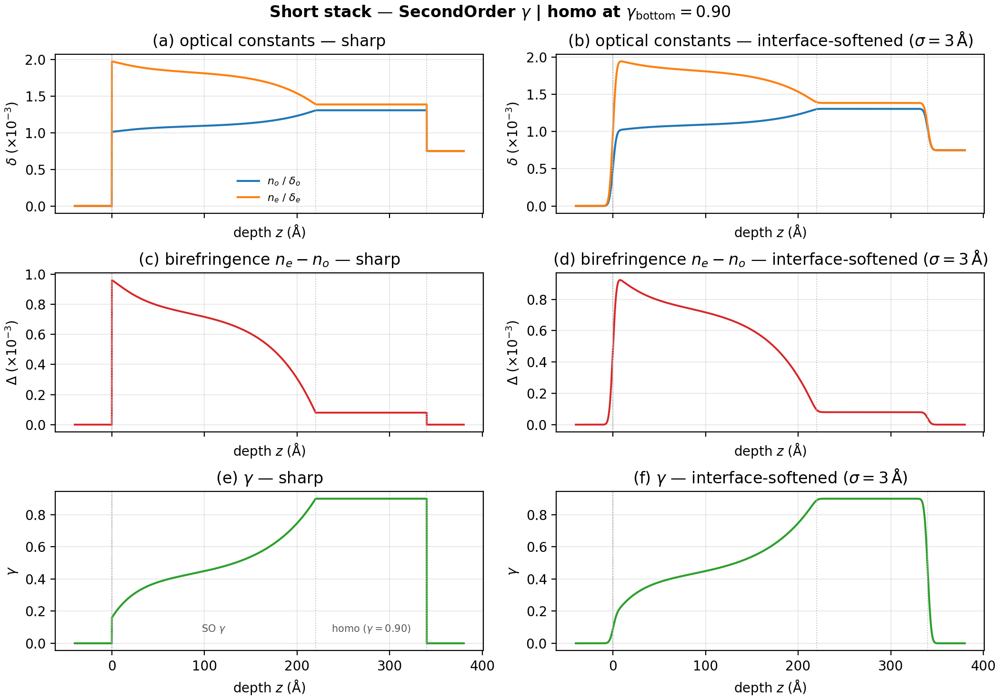
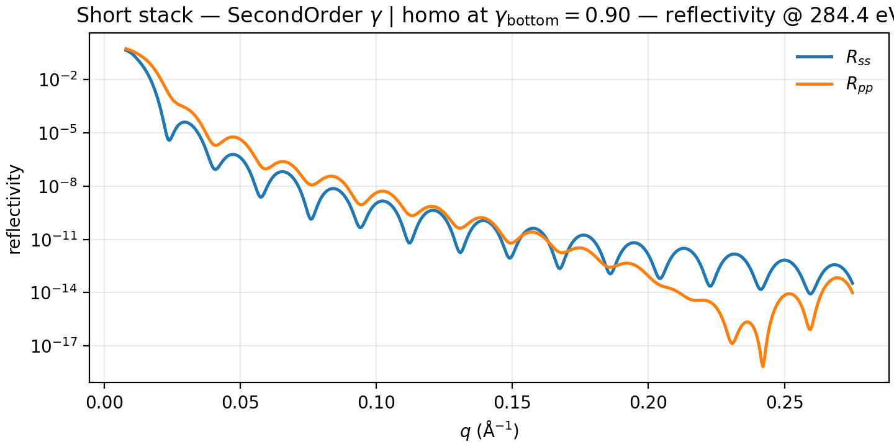

# Phase transitions

`SecondOrderTransition` profiles with annotated `top` / `bulk` / `bottom` and
decay lengths $\tau_\mathrm{top}$, $\tau_\mathrm{bottom}$. Drive orientation
($\gamma$), Mix composition ($\phi$), $\langle\cos^2\gamma\rangle$, or free
optical diagonals (`delta_o` / `delta_e` / …) with the same form object.

Shared preamble:

--8<-- "guides/building_structures/_preamble.md"

## Orientation (`gamma`)

**Builder:** `case_second_order_gamma`

```python
eta = SecondOrderTransition(
    thickness=320.0,
    bulk=0.40,
    top=0.15,
    bottom=0.90,
    tau_top=28.0,
    tau_bottom=55.0,
)
layer = DepthProfile(material=mat, thickness=320.0, roughness=2.0, gamma=eta)
stack = vac | layer | si
```





## Composition (`phi`)

**Builder:** `case_second_order_phi`

Same annotated constants, driving Mix volume fraction. Depth/reflectivity
use the profile-variant template ($n_o$/$n_e$, birefringence, $\phi$;
sharp | broadened).

```python
eta = SecondOrderTransition(
    thickness=220.0,
    bulk=0.5,
    top=0.9,
    bottom=0.1,
    tau_top=20.0,
    tau_bottom=40.0,
)
layer = DepthProfile(
    material=Mix([mat_a, mat_b], rule="linear"),
    thickness=220.0,
    phi=eta,
)
stack = vac | layer | si
```





## Order parameter (`<cos^2 gamma>`)

**Builder:** `case_second_order_cos2`

```python
eta = SecondOrderTransition(
    thickness=320.0,
    bulk=0.70,
    top=0.95,
    bottom=0.20,
    tau_top=28.0,
    tau_bottom=55.0,
)
layer = DepthProfile(material=mat, thickness=320.0, cos2_gamma=eta)
stack = vac | layer | si
```





## Stacking

**Builder:** `case_second_order_short_stack`

Orientation `SecondOrderTransition` over a homogeneous film whose constant
$\gamma$ equals the **bottom pin** ($\gamma_\mathrm{bottom}$), so the
transition settles into that orientation rather than an unrelated slab.

```python
eta = SecondOrderTransition(
    thickness=220.0,
    bulk=0.40,
    top=0.15,
    bottom=0.90,
    tau_top=28.0,
    tau_bottom=55.0,
)
orientation = DepthProfile(material=mat, thickness=220.0, roughness=2.0, gamma=eta)
# Homogeneous film at the same gamma as the bottom pin (lab diagonals via
# the same orientation map as DepthProfile with constant gamma=0.90).
pinned = DepthProfile(material=mat, thickness=120.0, gamma=0.90)
stack = vac | orientation | pinned | si
model = ReflectModel(stack, energies=[284.4], parallel=False)
```




