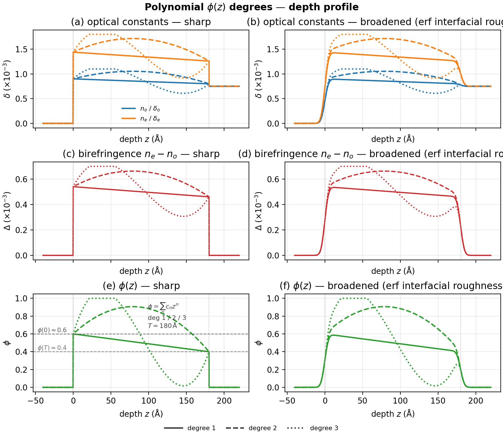
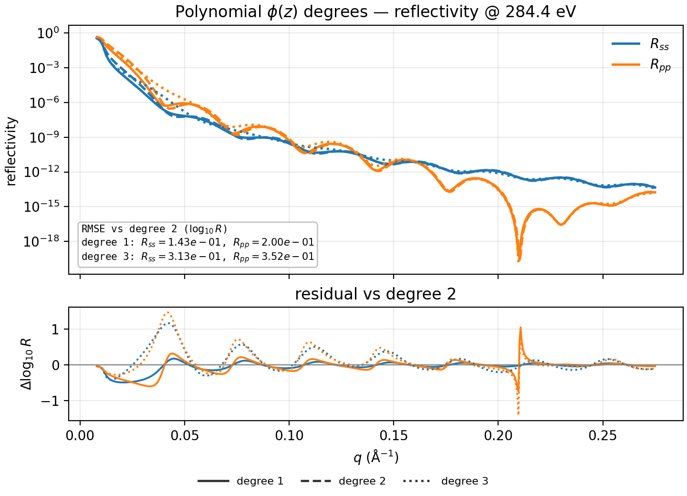
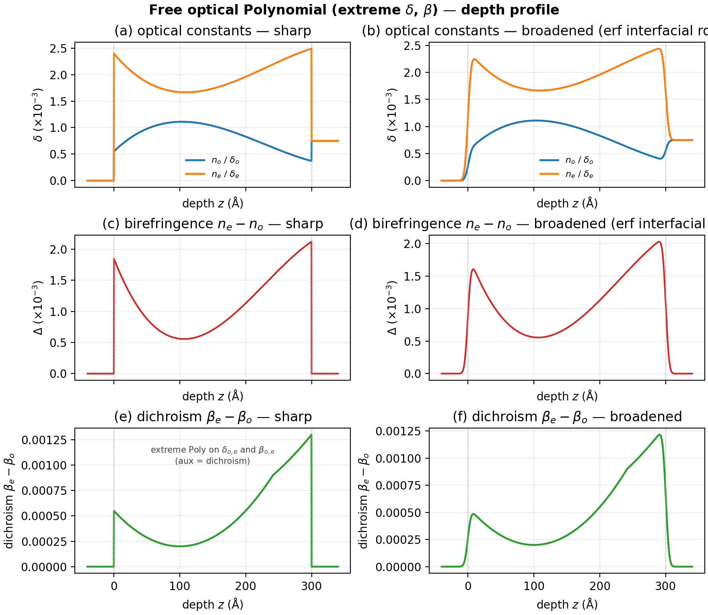
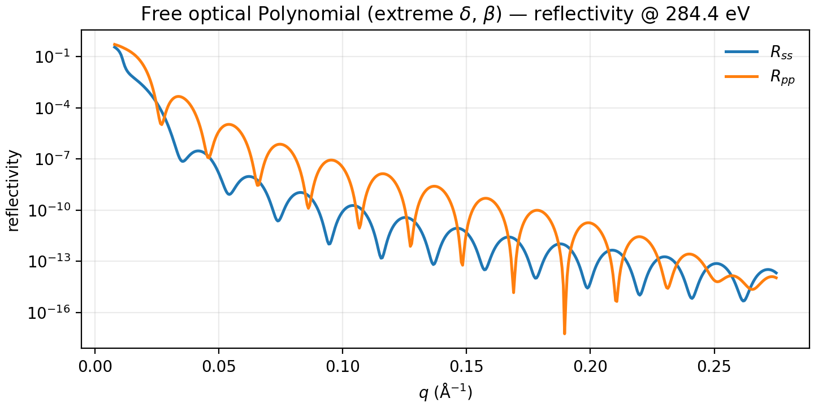
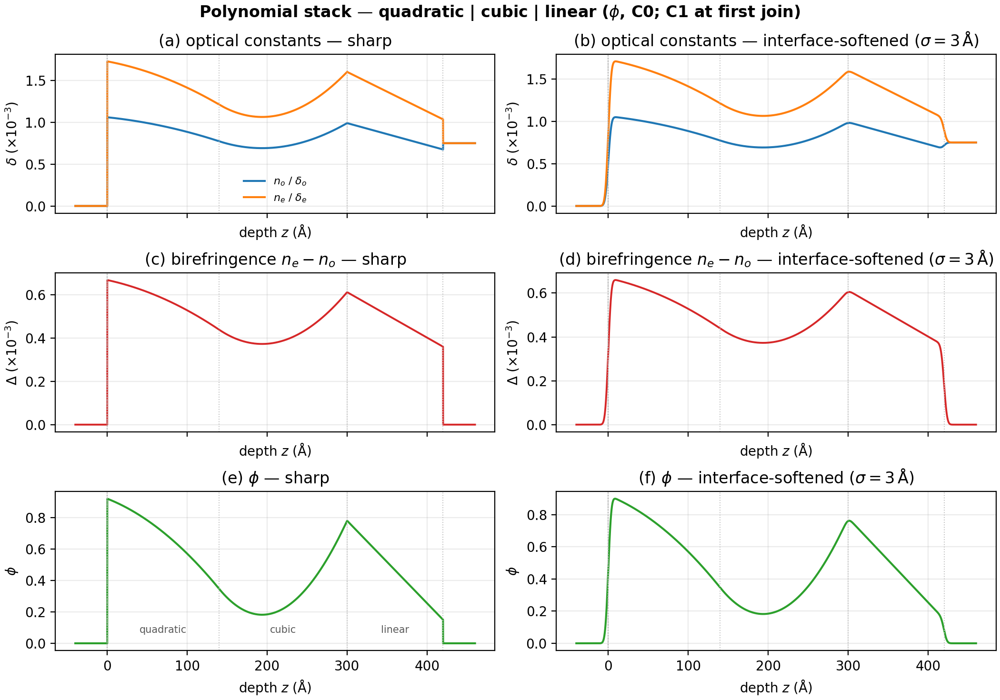
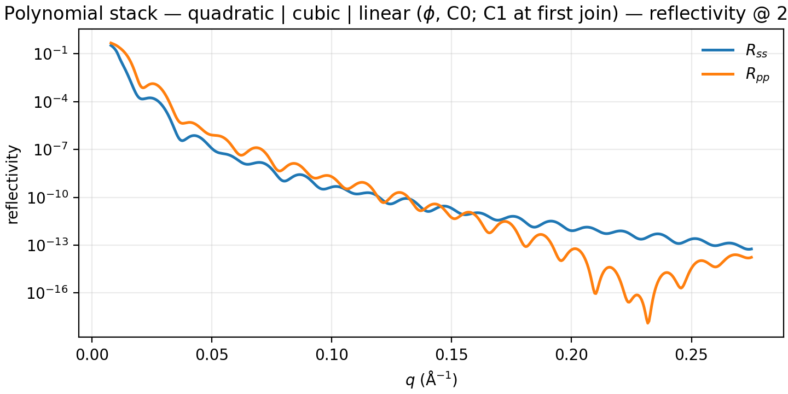

# Polynomials

Polynomial depth laws. The same `Polynomial` form drives Mix volume fraction
(`phi`) or free optical diagonals (`delta_o` / `delta_e` / `beta_o` /
`beta_e`) on a single material.

Shared preamble:

--8<-- "guides/building_structures/_preamble.md"

## Volume-fraction polynomial

**Builder:** `case_volfrac_polynomial`

Endpoints near $\phi(0)\approx 0.6$, $\phi(T)\approx 0.4$ (not a full 0–1
wedge). Degree 1 is a gentle linear grade; degree 2 adds a mid-film bump;
degree 3 adds a bump then dip before settling. Linear mix optics; linestyle
per degree; reflectivity residuals vs degree 2.

```python
t = 180.0
phi = Polynomial(coeffs=[0.6, 1.4 / t, -1.6 / t**2])  # degree 2
layer = DepthProfile(
    material=Mix([mat_a, mat_b], rule="linear"),
    thickness=t,
    phi=phi,
)
stack = vac | layer | si
```





## Free optical channels

**Builder:** `case_free_optical_polynomial`

Extreme cubic / quartic swings on $\delta_o$, $\delta_e$ **and** $\beta_o$,
$\beta_e$ (aux panel = dichroism). No Mix.

```python
delta_o = Polynomial(coeffs=[0.55e-3, 1.2e-5, -7.5e-8, 1.1e-10])
delta_e = Polynomial(coeffs=[2.40e-3, -1.5e-5, 9.0e-8, -1.3e-10])
beta_o = Polynomial(coeffs=[2.0e-4, 3.0e-6, -1.5e-8])
beta_e = Polynomial(coeffs=[7.5e-4, -4.0e-6, 2.0e-8])
layer = DepthProfile(
    material=mat,
    thickness=300.0,
    delta_o=delta_o,
    delta_e=delta_e,
    beta_o=beta_o,
    beta_e=beta_e,
)
stack = vac | layer | si
```





## Stacking

**Builder:** `case_free_optical_polynomial_short_stack`

Three Mix $\phi$ polynomials under `|`: **quadratic | cubic | linear** with
value matching at both joins and slope matching at the quadratic|cubic join.
See [Stacking examples](stacking.md) for kitchen-sink / free-optical zoos.

```python
t_q, t_c, t_l = 140.0, 160.0, 120.0
quad = DepthProfile(
    material=Mix([mat_a, mat_b], rule="linear"),
    thickness=t_q,
    phi=Polynomial(coeffs=[0.92, -0.0020, -1.5e-5]),
)
# cubic coeffs match phi and dphi/dz at the quadratic interface
cub = DepthProfile(
    material=Mix([mat_a, mat_b], rule="linear"),
    thickness=t_c,
    phi=Polynomial(coeffs=[0.346, -0.0062, 5.992e-5, -2.637e-8]),
)
lin = DepthProfile(
    material=Mix([mat_a, mat_b], rule="linear"),
    thickness=t_l,
    phi=Polynomial(coeffs=[0.78, -0.00525]),
)
stack = vac | quad | cub | lin | si
model = ReflectModel(stack, energies=[284.4], parallel=False)
```




