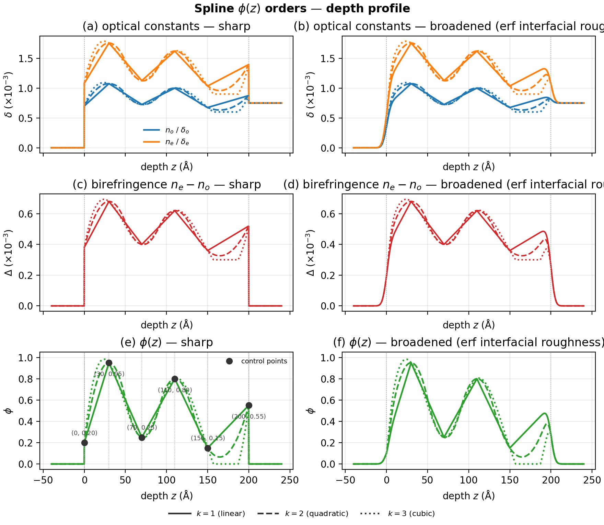
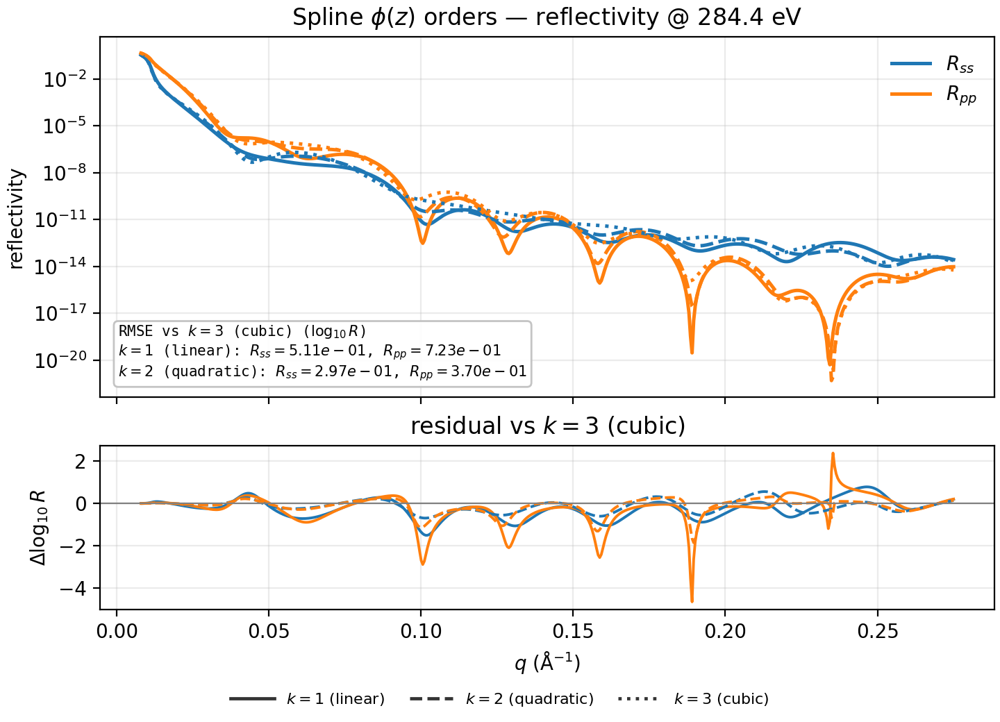
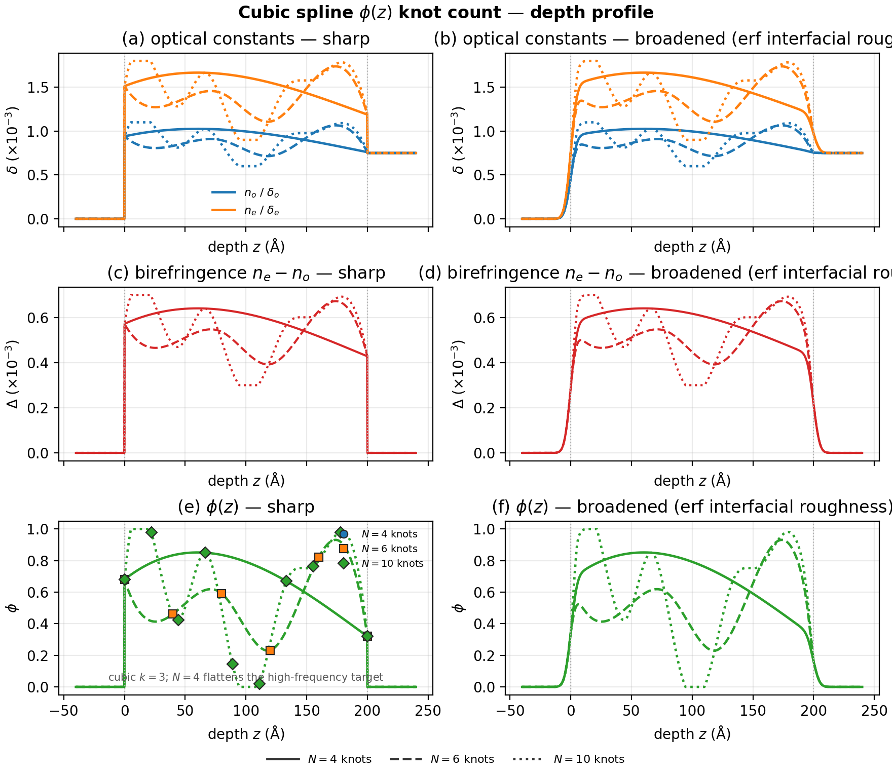
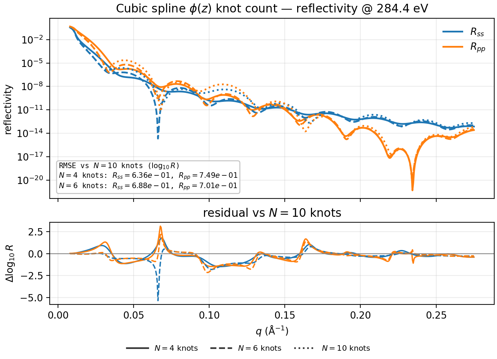
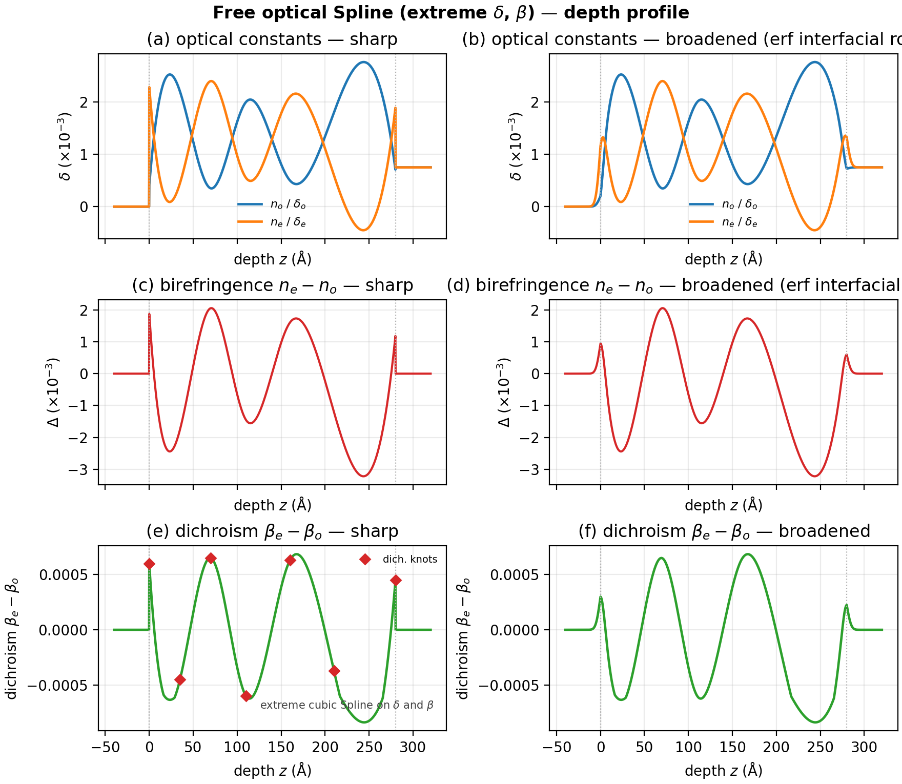
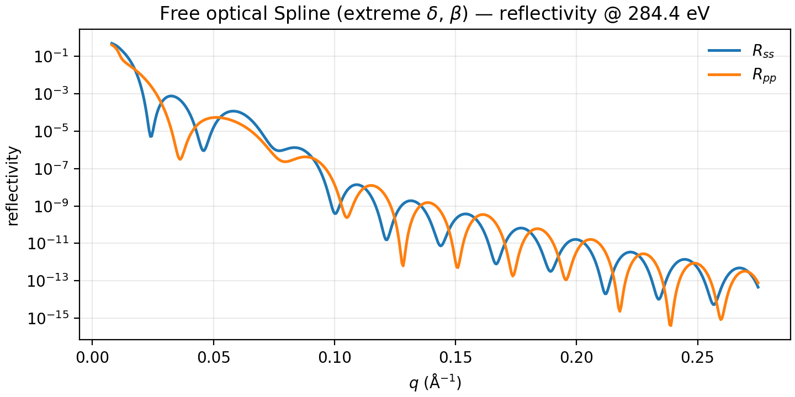

# Splines

Knotted depth laws. Product `Spline` is cubic/natural. The same `Spline`
object can drive Mix volume fraction (`phi`) or free optical diagonals
(`delta_o` / `delta_e` / `beta_o` / `beta_e`).

**Builders:** `case_volfrac_spline`, `case_free_optical_spline`

Shared preamble:

--8<-- "guides/building_structures/_preamble.md"

## Changing spline order ($\phi$)

Same six control points; linestyles mark $k=1$ (piecewise linear), $k=2$
(quadratic), and $k=3$ (cubic). Linear mix optics; residuals vs cubic.

```python
phi = Spline(
    knots=[0.0, 30.0, 70.0, 110.0, 150.0, 200.0],
    values=[0.20, 0.95, 0.25, 0.80, 0.15, 0.55],
)
layer = DepthProfile(
    material=Mix([mat_a, mat_b], rule="linear"),
    thickness=200.0,
    phi=phi,
)
stack = vac | layer | si
```





## Changing control-point count (cubic $\phi$)

Fix $k=3$ and sample a **high-frequency** target with $N=4$, $6$, and $10$
equally spaced knots. Sparse polygons flatten the mid-film swings; denser
knots recover them. Reflectivity residuals vs $N=10$.

```python
import numpy as np

t = 200.0


def target(z: np.ndarray) -> np.ndarray:
    x = z / t
    return np.clip(
        0.50
        + 0.45 * np.sin(3 * np.pi * x)
        + 0.30 * np.sin(7 * np.pi * x)
        + 0.18 * np.cos(5 * np.pi * x),
        0.02,
        0.98,
    )


stacks = {}
for n in (4, 6, 10):
    knots = np.linspace(0.0, t, n)
    phi = Spline(knots=knots.tolist(), values=target(knots).tolist())
    layer = DepthProfile(
        material=Mix([mat_a, mat_b], rule="linear"),
        thickness=t,
        phi=phi,
    )
    stacks[f"N={n}"] = vac | layer | si
```





## Free optical channels

**Builder:** `case_free_optical_spline`

Extreme seven-knot cubic Splines on $\delta_o$, $\delta_e$, $\beta_o$, and
$\beta_e$ (large anti-correlated swings; aux = dichroism). No Mix.

```python
knots = [0.0, 35.0, 70.0, 110.0, 160.0, 210.0, 280.0]
delta_o = Spline(
    knots=knots,
    values=[0.40e-3, 2.20e-3, 0.35e-3, 2.00e-3, 0.50e-3, 1.80e-3, 0.70e-3],
)
delta_e = Spline(
    knots=knots,
    values=[2.30e-3, 0.45e-3, 2.40e-3, 0.55e-3, 2.10e-3, 0.60e-3, 1.90e-3],
)
beta_o = Spline(
    knots=knots,
    values=[1.0e-4, 6.0e-4, 1.5e-4, 7.0e-4, 1.2e-4, 5.5e-4, 2.0e-4],
)
beta_e = Spline(
    knots=knots,
    values=[7.0e-4, 1.5e-4, 8.0e-4, 1.0e-4, 7.5e-4, 1.8e-4, 6.5e-4],
)
layer = DepthProfile(
    material=mat,
    thickness=280.0,
    delta_o=delta_o,
    delta_e=delta_e,
    beta_o=beta_o,
    beta_e=beta_e,
)
stack = vac | layer | si
```





Multi-form stacks that include free-optical Splines are on
[Stacking examples](stacking.md).
