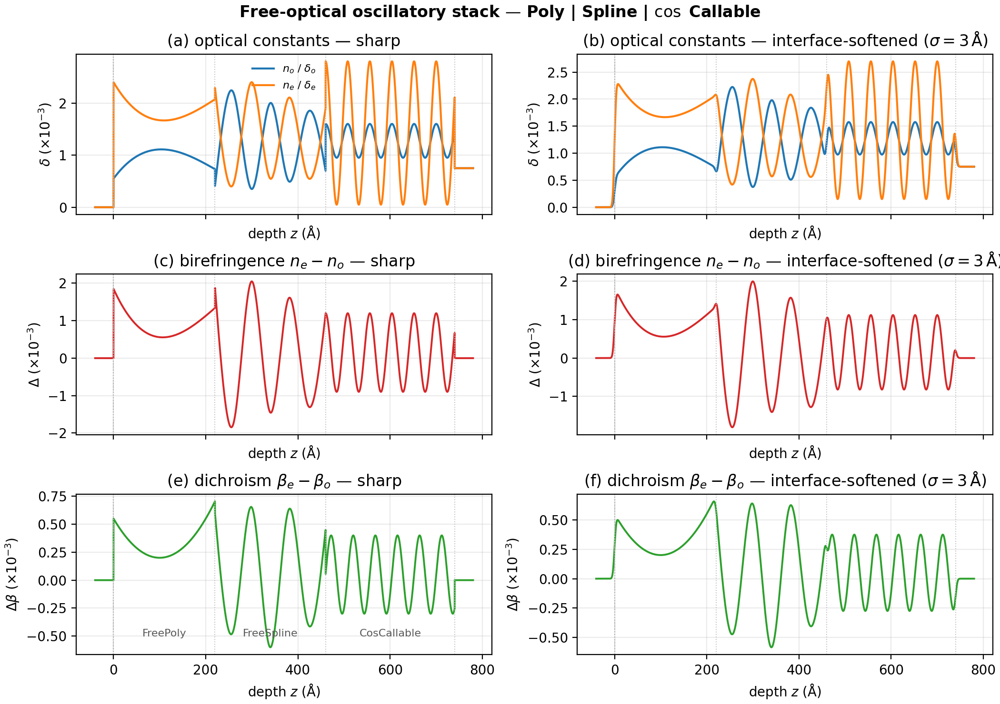
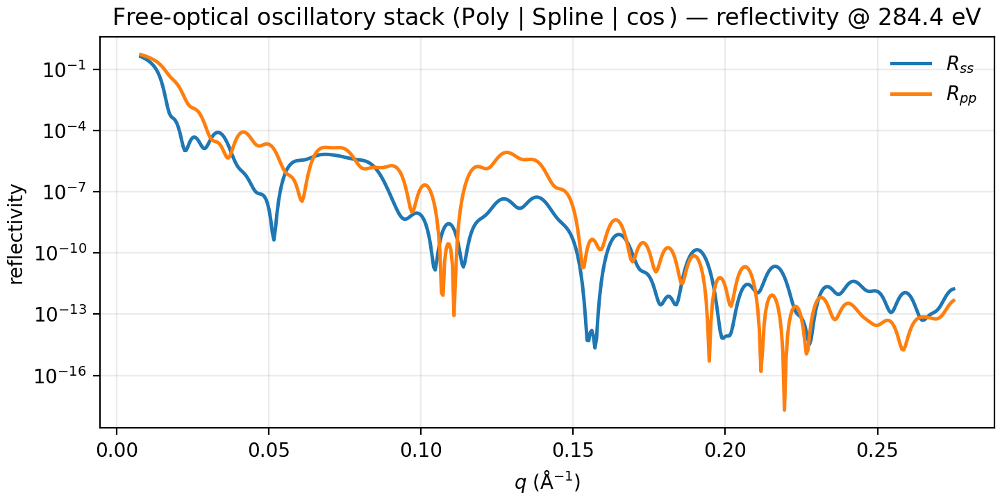
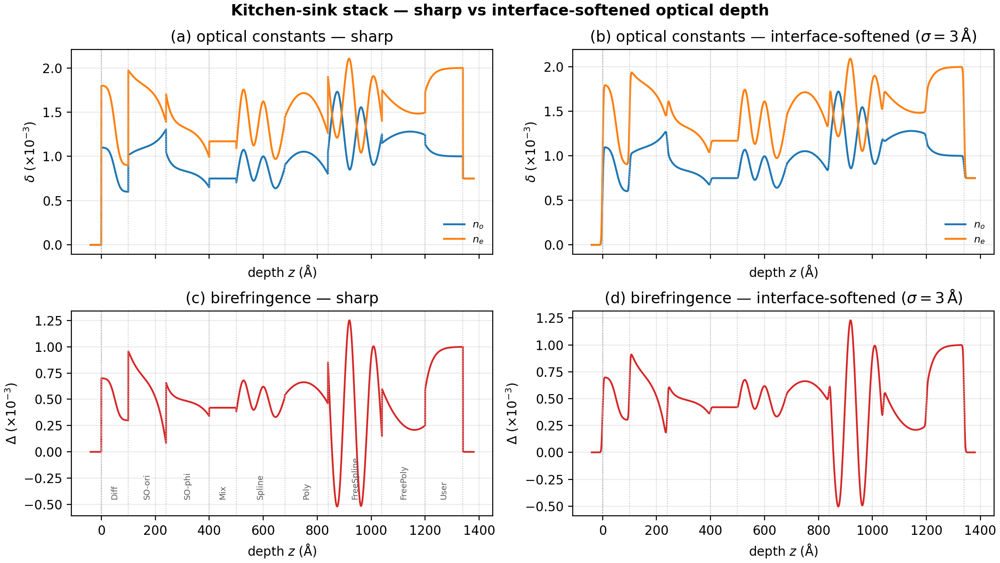
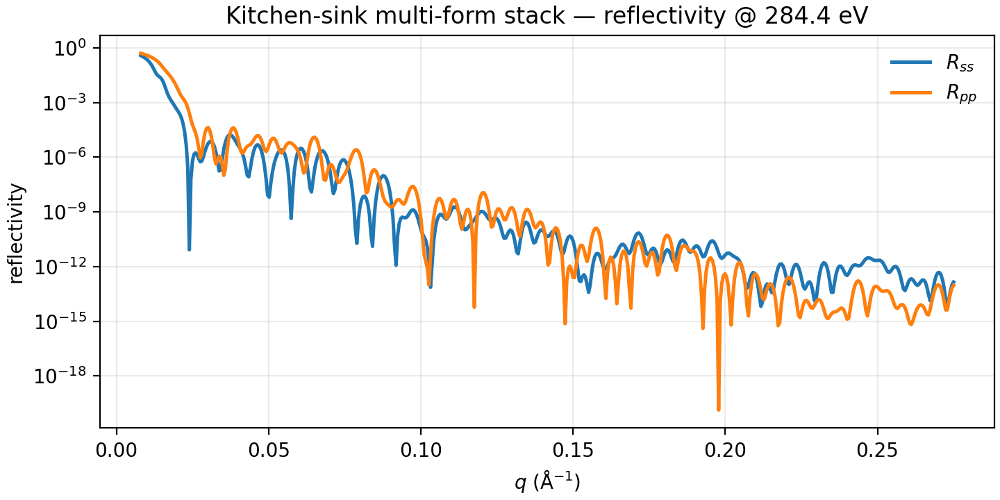

# Stacking examples

Compose layers with `|`. Vacuum and substrate bookend the film stack; each
operand is a homogeneous slab, `Mix(...)(thick, rough)`, or `DepthProfile`.

Short compositional stacks live at the end of the feature pages
([Diffusion](diffusion.md), [Phase transitions](phase_transitions.md),
[Polynomials](polynomials.md), [Callables](callables.md)). This page holds
richer multi-form showcases (free-optical osc stack and kitchen-sink).

Shared preamble:

--8<-- "guides/building_structures/_preamble.md"

## Free-optical oscillatory stack

**Builder:** `case_free_optical_osc_stack`

Extreme free-optical Polynomial | extreme free-optical Spline | $\cos$-driven
`CallableField` (mean $\delta$, birefringence, and phase-shifted dichroism).
Depth figure shows $\delta$, birefringence, and dichroism with mild interface
softening (not a midpoint staircase).

```python
import numpy as np
from numpy.typing import NDArray
from refnx.analysis import Parameter

free_poly = DepthProfile(
    material=mat,
    thickness=220.0,
    delta_o=Polynomial(coeffs=[0.55e-3, 1.2e-5, -7.5e-8, 1.1e-10]),
    delta_e=Polynomial(coeffs=[2.40e-3, -1.5e-5, 9.0e-8, -1.3e-10]),
    beta_o=Polynomial(coeffs=[2.0e-4, 3.0e-6, -1.5e-8]),
    beta_e=Polynomial(coeffs=[7.5e-4, -4.0e-6, 2.0e-8]),
)
knots = list(np.linspace(0.0, 240.0, 7))
free_spline = DepthProfile(
    material=mat,
    thickness=240.0,
    delta_o=Spline(
        knots=knots,
        values=[0.40e-3, 2.20e-3, 0.35e-3, 2.00e-3, 0.50e-3, 1.80e-3, 0.70e-3],
    ),
    delta_e=Spline(
        knots=knots,
        values=[2.30e-3, 0.45e-3, 2.40e-3, 0.55e-3, 2.10e-3, 0.60e-3, 1.90e-3],
    ),
    beta_o=Spline(
        knots=knots,
        values=[1e-4, 6e-4, 1.5e-4, 7e-4, 1.2e-4, 5.5e-4, 2e-4],
    ),
    beta_e=Spline(
        knots=knots,
        values=[7e-4, 1.5e-4, 8e-4, 1e-4, 7.5e-4, 1.8e-4, 6.5e-4],
    ),
)
period = Parameter(48.0, name="period")


def free_delta_o(
    z: NDArray[np.float64], *, period: float, thickness: float
) -> NDArray[np.float64]:
    c = np.cos(2 * np.pi * z / period)
    mid = 1.35e-3 + 0.85e-3 * c
    biref = 0.15e-3 + 1.05e-3 * c
    return mid - 0.5 * biref


def free_delta_e(
    z: NDArray[np.float64], *, period: float, thickness: float
) -> NDArray[np.float64]:
    c = np.cos(2 * np.pi * z / period)
    mid = 1.35e-3 + 0.85e-3 * c
    biref = 0.15e-3 + 1.05e-3 * c
    return mid + 0.5 * biref


def free_beta_o(
    z: NDArray[np.float64], *, period: float, thickness: float
) -> NDArray[np.float64]:
    s = np.sin(2 * np.pi * z / period)
    b_mid = 4.5e-4 + 2.5e-4 * s
    dich = 0.5e-4 + 3.5e-4 * s
    return np.clip(b_mid - 0.5 * dich, 5e-5, None)


def free_beta_e(
    z: NDArray[np.float64], *, period: float, thickness: float
) -> NDArray[np.float64]:
    s = np.sin(2 * np.pi * z / period)
    b_mid = 4.5e-4 + 2.5e-4 * s
    dich = 0.5e-4 + 3.5e-4 * s
    return np.clip(b_mid + 0.5 * dich, 5e-5, None)


params = {"period": period}
cos_callable = DepthProfile(
    material=mat,
    thickness=280.0,
    delta_o=CallableField(free_delta_o, params=params),
    delta_e=CallableField(free_delta_e, params=params),
    beta_o=CallableField(free_beta_o, params=params),
    beta_e=CallableField(free_beta_e, params=params),
)
stack = vac | free_poly | free_spline | cos_callable | si
model = ReflectModel(stack, energies=[284.4], parallel=False)
```





## Kitchen-sink stack

**Builder:** `case_kitchen_sink`

Nine segments under `|`: Diffusion, SecondOrder (orientation + composition),
homogeneous Mix, a wiggly volfrac Spline, a mid-bump volfrac Polynomial,
**free-optical Spline**, **free-optical Polynomial**, and a user
`CallableField`. Depth figure labels mark each segment.

The right column is **mild Gaussian interface softening**
($\sigma\approx 3\,\mathrm{\AA}$) of the continuous sharp profile — not a
per-slab midpoint staircase — so spline / poly structure inside layers stays
visible.

```python
import numpy as np
from numpy.typing import NDArray
from refnx.analysis import Parameter

diffusion_layer = DepthProfile(
    material=Mix([mat_a, mat_b], rule="linear"),
    thickness=100.0,
    roughness=1.0,
    phi=Diffusion(thickness=100.0, left=1.0, right=0.0, length=22.0, kind="couple"),
)
second_order_orientation = DepthProfile(
    material=mat,
    thickness=140.0,
    gamma=SecondOrderTransition(
        thickness=140.0, bulk=0.4, top=0.15, bottom=0.9, tau_top=24.0, tau_bottom=45.0
    ),
)
second_order_composition = DepthProfile(
    material=Mix([mat_a, mat_b], rule="linear"),
    thickness=160.0,
    phi=SecondOrderTransition(
        thickness=160.0, bulk=0.5, top=0.9, bottom=0.1, tau_top=20.0, tau_bottom=40.0
    ),
)
mixed_slab = Mix([mat_a, mat_b], fractions=[0.3, 0.7], rule="linear")(100.0, 2.0)

t_spl = 180.0
volfrac_spline = DepthProfile(
    material=Mix([mat_a, mat_b], rule="linear"),
    thickness=t_spl,
    phi=Spline(
        knots=[0.0, 0.15 * t_spl, 0.35 * t_spl, 0.55 * t_spl, 0.75 * t_spl, t_spl],
        values=[0.20, 0.95, 0.25, 0.80, 0.15, 0.55],
    ),
)
t_poly = 160.0
volfrac_polynomial = DepthProfile(
    material=Mix([mat_a, mat_b], rule="linear"),
    thickness=t_poly,
    phi=Polynomial(coeffs=[0.6, 1.4 / t_poly, -1.6 / t_poly**2]),
)
t_fs = 200.0
free_optical_spline = DepthProfile(
    material=mat,
    thickness=t_fs,
    delta_o=Spline(
        knots=[0.0, 0.2 * t_fs, 0.4 * t_fs, 0.6 * t_fs, 0.8 * t_fs, t_fs],
        values=[1.05e-3, 1.70e-3, 0.85e-3, 1.55e-3, 0.95e-3, 1.25e-3],
    ),
    delta_e=Spline(
        knots=[0.0, 0.2 * t_fs, 0.4 * t_fs, 0.6 * t_fs, 0.8 * t_fs, t_fs],
        values=[1.90e-3, 1.25e-3, 2.10e-3, 1.05e-3, 1.85e-3, 1.40e-3],
    ),
    beta_o=4e-4,
    beta_e=6e-4,
)
t_fp = 160.0
free_optical_polynomial = DepthProfile(
    material=mat,
    thickness=t_fp,
    delta_o=Polynomial(coeffs=[1.15e-3, 2.5e-6, -1.2e-8]),
    delta_e=Polynomial(coeffs=[1.75e-3, -4e-6, 1.5e-8]),
    beta_o=4e-4,
    beta_e=6e-4,
)

def my_gamma(
    z: NDArray[np.float64], *, g0: float, lam: float, thickness: float
) -> NDArray[np.float64]:
    return g0 * np.exp(-z / lam)

user_defined_field = DepthProfile(
    material=mat,
    thickness=140.0,
    gamma=CallableField(
        my_gamma,
        params={
            "g0": Parameter(0.55, name="g0"),
            "lam": Parameter(45.0, name="lam"),
        },
    ),
)

structure = (
    vac
    | diffusion_layer
    | second_order_orientation
    | second_order_composition
    | mixed_slab
    | volfrac_spline
    | volfrac_polynomial
    | free_optical_spline
    | free_optical_polynomial
    | user_defined_field
    | si
)
model = ReflectModel(structure, energies=[284.4], parallel=False)
```




